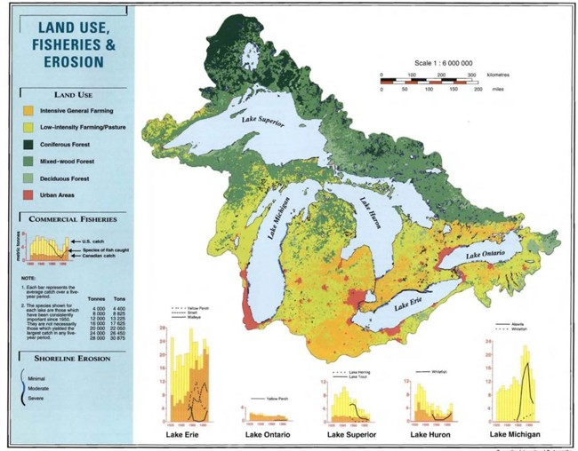
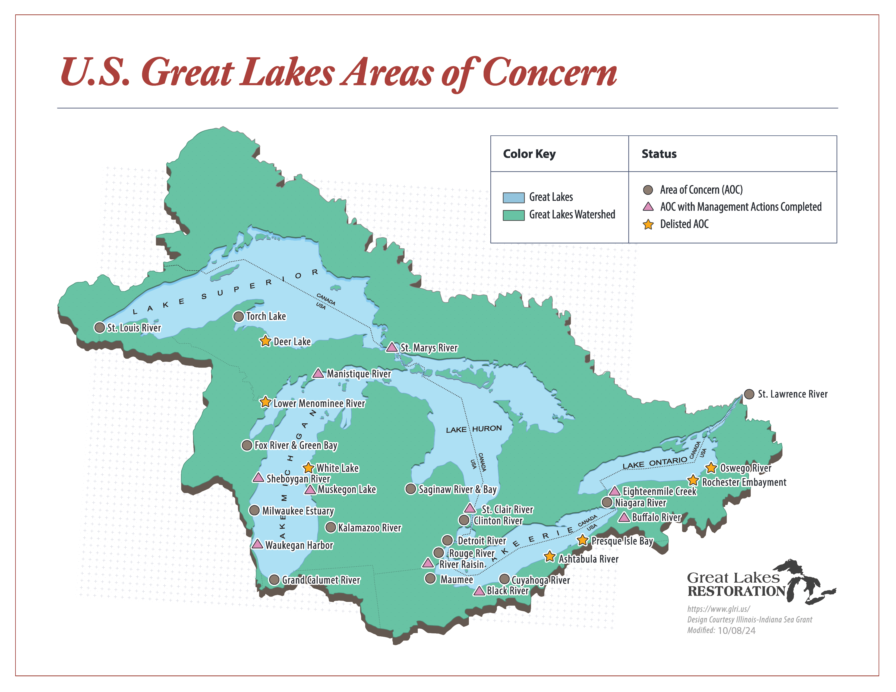
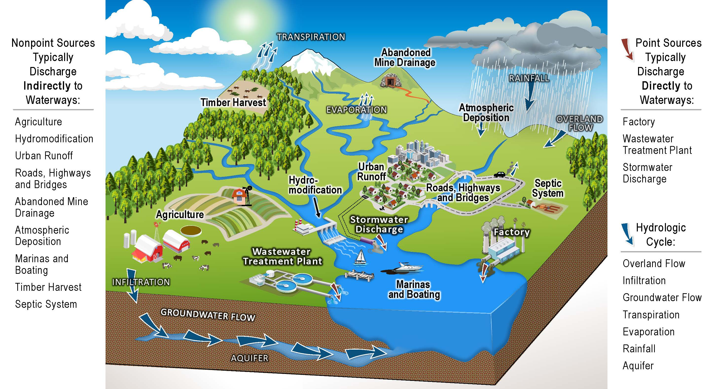
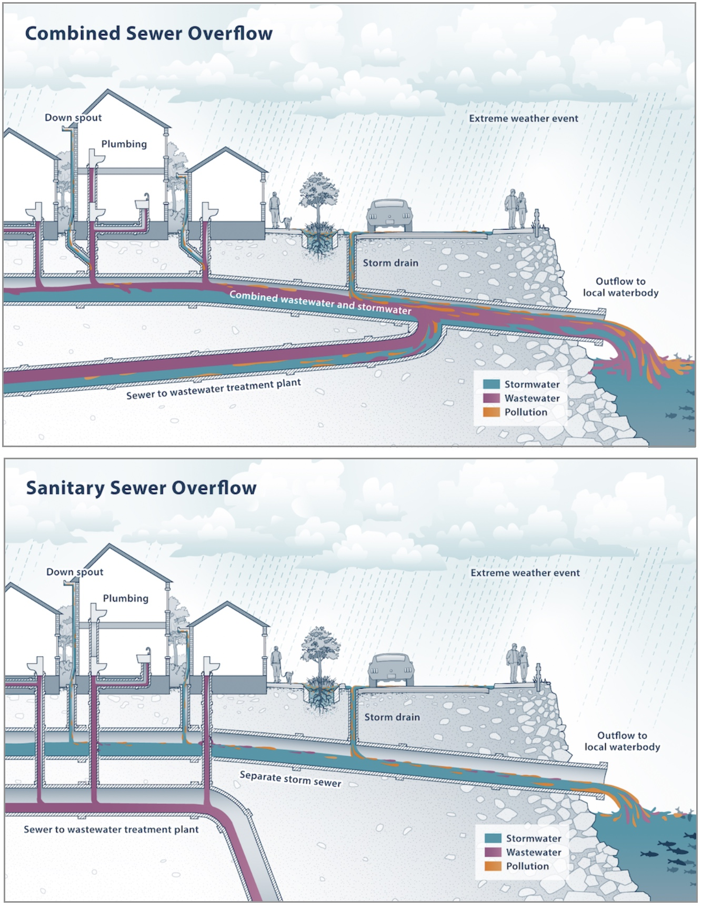

**Learning Objectives**

-   Review ecosystem services provided by Great Lakes natural resources
-   Examine impacts of humans on the Great Lakes environment
-   Distinguish point source from nonpoint source water pollution
-   Define recommended management practices for protecting water quality

------------------------------------------------------------------------

The Laurentian Great Lakes are the largest freshwater surface water system on Earth and contain approximately 21% of the world’s freshwater supply (US EPA, n.d.). The Great Lakes support shipping corridors, agricultural production, industrial activity, tourism, fisheries, and dense urban development.

The benefits humans derive from this system are substantial, and so are the pressures placed upon it. Decisions about how land is used, how infrastructure is built, and how waste is managed across thousands of communities collectively shape the condition of the lakes themselves.

Managing a freshwater system of this scale requires understanding the lakes themselves as well as the landscapes and waterways that feed them.

## How Great Are These Lakes?

The Laurentian Great Lakes are a single, connected system flowing west to east through several connecting tributaries. Each lake has unique physical properties and social characteristics shaped by patterns of settlement, land use, and economic development.

-   **Lake Superior** is the largest and coldest lake. Because it has the least development, it also has the cleanest water.
-   **Lake Michigan** is the second largest lake and has a high amount of industrial and urban development, housing ⅕ of the basin population along its southern shore.
-   **Lake Huron** is the third largest lake by volume and has intensive agricultural development in the Saginaw Bay region.
-   **Lake Erie** is the smallest, most shallow lake with the warmest water temperatures. It has experienced the greatest impairment from urbanization and agriculture due to the large amount of runoff it receives from Ontario, Ohio, Indiana, and Michigan.
-   **Lake Ontario** is deeper than Lake Erie and therefore has a slightly larger volume. The Canadian side of the lake is highly urbanized, contributing impairments from runoff.

{fig-alt="Land use in the Great Lakes basin, including forested, farmed, and developed land."}

Although these lakes differ in size, depth, and land use context, they are linked by the movement of water and by the cumulative effects of human activity across the basin. <abbr title="Benefits that society receives from the environment."
      style="font-weight: bold; text-decoration: underline dotted; cursor: help;"> <em>Ecosystem services</em> </abbr> are benefits that humans obtain from the natural world and its ecosystems that make modern civilization possible (Steinman et al., 2017). These include:

-   **Regulating services** - air and water purification, temperature control.
-   **Provisioning services** - freshwater, food production, fish, wood.
-   **Supporting services** - soil fertility, photosynthesis, habitat and biodiversity.
-   **Cultural services** - recreation and tourism, traditions, scenic beauty.

When the Great Lakes Basin was settled by Europeans, it experienced widespread logging, conversion of forests to farmland, and fish were harvested in large numbers without attention to sustainability. Industrialization and urbanization further degraded Great Lakes water quality. Industrial byproducts and untreated sewage were discharged directly into the lakes. Commercial travel opened the formerly isolated inland lakes to the Atlantic Ocean and the Mississippi River. Ships traveling between water bodies transported invasive hitchhikers, like the zebra mussel, that have wreaked chaos on the Great Lakes food web (Egan, 2017).

Exploitation of Great Lakes natural resources fueled the Industrial and Green Revolutions that catapulted human civilization into the modern era. The lifestyles we enjoy today came at heavy costs to Great Lakes ecosystems. However, the Great Lakes are also remarkably resilient. Through collaborative management, great strides have been made toward restoration.

## From Degradation to Governance

The U.S. and Canada have long recognized their shared stake in protecting the Great Lakes. In 1909 the two countries signed the Boundary Waters Treaty, which outlines principles for preventing and dealing with conflict over shared water. The <abbr title="A binational governance body that makes decisions related to actions with potential to affect water levels and water quality in the Great Lakes."
      style="font-weight: bold; text-decoration: underline dotted; cursor: help;"> <em>International Joint Commission (IJC)</em> </abbr> is a binational governance body established in 1912 to mitigate disputes and coordinate management of lake and river systems along the U.S. - Canadian border (IJC, n.d.). Because of the broad range of ecosystem services the Great Lakes provide to Americans and Canadians, the IJC deals with a dizzying range of decisions - from drinking water, to farming, to shipping, and fishing, and hydropower - oh my!

By the 1960s, bacterial and chemical contamination, and floating debris in the lakes caused sufficient public concern to motivate political action. In 1972, the U.S. and Canada signed the <abbr title="An agreement between the United States and Canada creating a framework for prioritizing issues and implementing actions to protect water quality in the Great Lakes."
      style="font-weight: bold; text-decoration: underline dotted; cursor: help;"> <em>Great Lakes Water Quality Agreement</em> </abbr>, committing to "restore and protect the waters of the Great Lakes" (U.S. EPA, n.d.).

As a result of the Great Lakes Water Quality Agreement, in 1987 the U.S. and Canada designated 43 highly degraded shoreline sites as <abbr title="Highly degraded shoreline sites defined by the Great Lakes Water Quality Agreement in 1987."
      style="font-weight: bold; text-decoration: underline dotted; cursor: help;"> <em>Areas of Concern.</em> </abbr> These sites became the focus of cleanup and restoration efforts. The agreement defined fourteen <abbr title="Chemical, physical, or biological changes compromising the integrity of Great Lakes ecosystems."
      style="font-weight: bold; text-decoration: underline dotted; cursor: help;"> <em>beneficial use impairments (BUIs)</em> </abbr> resulting from chemical, physical, or biological changes compromising the integrity of lake ecosystems. All BUIs must be restored before a site can be delisted as a Great Lakes AOC.

{fig-alt="Great Lakes Areas of Concern in the U.S."}

In the U.S., the AOC program is administered by the Environmental Protection Agency (EPA) with funding from the Great Lakes Legacy Act and the Great Lakes Restoration Initiative (GLRI). Each year these programs fund millions of dollars worth of contaminated sediment removal, invasive species mitigation, shoreline and habitat restoration, and environmental monitoring in the Great Lakes Basin.

An example close to home is Muskegon Lake, where the [GVSU Annis Water Resources Institute](https://www.gvsu.edu/wri/) is located. Learn more in the video, *Back from the Brink*.

<iframe width="560" height="315" src="https://www.youtube.com/embed/n7HCN0RQK-w?si=nnEaMz0f4CiuLDjw" title="YouTube video player" frameborder="0" allow="accelerometer; autoplay; clipboard-write; encrypted-media; gyroscope; picture-in-picture; web-share" referrerpolicy="strict-origin-when-cross-origin" allowfullscreen>

</iframe>

As legacy pollution sites are remediated, management efforts are increasingly focused on ongoing sources of impairment - particularly those that originate far from the shoreline.

## Point and Nonpoint Source Pollution

Where are you at right now? The answer may not be as straightforward as you think, especially when the question is considered at the watershed scale.

A <abbr title="An area of land that drains into a common body of water."
      style="font-weight: bold; text-decoration: underline dotted; cursor: help;"> <em>watershed</em> </abbr> encompasses the area of land that drains into a common body of water, as well as the body of water itself (LGROW, N.d). Watersheds can also be subdivided into smaller subwatersheds that flow together to form larger sub-basins and river or lake basins (Groundswell, N.d). It follows that, at any given time, we can be located in many watersheds at once.

Watersheds illustrate that natural processes do not follow political boundaries. Rainfall and snowmelt move across agricultural fields, residential neighborhoods, roads, and industrial sites, carrying pollutants into tributaries that eventually feed the Great Lakes. Millions of people contribute pollutants to the basin through a wide variety of everyday actions.

{fig-alt="Diagram of a watershed."}

Previously, we reviewed legacy pollution in the Great Lakes that has been caused primarily by <abbr title="Water pollution that has a single, identifiable source."
      style="font-weight: bold; text-decoration: underline dotted; cursor: help;"> <em>point source pollutants</em> </abbr>. These are water impairments that can be traced to a single, clearly identifiable source, like a wastewater discharge pipe. Entities like factories, city wastewater treatment plants, and large confined animal feeding operations can apply to state environmental regulatory agencies, (i.e., the Michigan Department of Environment, Great Lakes, and Energy, or "EGLE") for a permit to discharge a regulated amount of treated wastewater to a surface water body (MI EGLE, n.d.). Permit holders are then subject to monitoring and can be fined if they are found to be releasing a higher concentration of pollutants than legally permitted.

While it is an imperfect system, regulatory mechanisms like wastewater discharge permits make point source pollution more manageable than in the pre-1970s era when unregulated industrial waste products, freely dumped into the Great Lakes, created the legacy pollution sites now managed by the Areas of Concern program.

Today, <abbr title="Water pollution that comes from numerous, diffuse sources."
      style="font-weight: bold; text-decoration: underline dotted; cursor: help;"> <em>nonpoint source (NPS) pollutants</em> </abbr> remain the most vexing form of water pollution from a management perspective. NPS pollutants from stormwater washing off of buildings, across streets, yards, and farm fields, and carrying pollutants into tributaries of the Great Lakes from dispersed sources are a serious management challenge (US EPA, 2024).

NPS pollution is exacerbated by urban development, which increases <abbr title="Hardened surfaces, like parking lots, that do not allow water to pass through the Earth's surface into soil or groundwater."
      style="font-weight: bold; text-decoration: underline dotted; cursor: help;"> <em>impervious surfaces</em> </abbr> that do not allow water to infiltrate, or pass through the soil to underground aquifers. Hardened surfaces speed up the flow of rain water and snowmelt, increasing erosion and washing litter, motor oil, household chemicals, baby diapers, or anything else in the path of flowing water right into a storm drain.

{fig-alt="Diagram depicting a combined sewer system and a modern separated sewer system."}

To understand the consequences, we need an infrastructure crash course. It used to be (and in many small towns, it still is the case) that the pipes carrying stormwater from storm drains along roadways and sidewalks were combined with pipes carrying wastewater from sewage lines. Contents of both were co-mingled and traveled to wastewater treatment plants, where they were filtered and treated to remove harmful chemicals and bacteria before being discharged to a nearby surface waterway. Sounds nice, right? Except for when it REALLY rains. Large volumes of stormwater can overwhelm combined sewer systems, causing them to overflow and discharge excess contents - including raw sewage - directly to ground and surface waters. Gross.

In modern municipal sewer systems, storm drains are separated from wastewater pipes to prevent sewer overflow and reduce raw sewage discharges. However, in these modern separated systems, the contents of storm drains are redirected from wastewater treatment facilities, instead discharging directly to surface waterways without being treated. That slow anti-freeze leak in your car, the plastic food wrapper you tossed out a window, the dog poop pile you left on the sidewalk - all of these NPS pollutants can be carried directly to a surface water body by the next rain storm. This makes managing Great Lakes water resources an all-hands-on-deck affair.

## Implications for Management

The consequences of water pollution flow along downstream, impacting other communities far from their source. Because watersheds are connected systems, pollutants introduced in one location may affect water quality, habitat, and human uses miles away. In the Great Lakes basin, the following negative impacts of NPS pollution have been a focal point of NPS management efforts:

**Sedimentation** occurs when excessive soil containing clay, silt, and fine organic and inorganic matter enters a water body due to erosion. This results in suspended particles that contribute to turbidity, preventing sunlight from reaching aquatic plants, clogging fish gills, choking organisms, raising water temperature, and interfering with fish spawning. What a mess!

Sedimentation is commonly associated with soil erosion along streambanks, removal of shoreline vegetation, loss of soil from agricultural fields, runoff from construction sites, and runoff from storm drains. It is often identified by watershed residents as a visible water quality problem - highly sedimented water will appear cloudy or muddy and is aesthetically unpleasing.

**Nutrient loading** occurs when fertilizers containing nitrogen and phosphorus, which help plants grow, are applied excessively or closely to a shoreline, and run off into a nearby water body. Once in the water, the nutrients feed algae, causing it to grow rapidly. Large amounts of algae reduce oxygen levels as they die and decompose, compromising water quality and causing fish kills.

Nutrient-related impairments are frequently linked to lawn fertilizers, agricultural fertilizer and manure applications, and failing septic systems. They are related to sedimentation because nutrients can bind to soils. Soil erosion can therefore carry nutrient-laden sediments into waterways. Nutrient pollution is often associated with excessive plant or algae growth in waterways.

**Bacterial pathogens**, such as *E. coli* bacteria, can cause disease to humans and animals, making them a serious health threat. Bacterial pathogens are typically introduced to waterways through untreated wastewater or raw sewage discharges, as well as from farm fields treated with manure applications or where many animals are closely confined. Elevated bacteria levels are a common cause of beach closure and drinking water advisories, particularly after major rainfall events.

In addition to these major categories of water pollution, trash and litter, invasive species, excessive algae growth, and elevated water temperatures are also common sources of pollution in watersheds. They are often related to other water quality impairments, since nutrients feed algae growth and sedimentation raises water temperatures. Therefore, managing water pollution involves considering broad, interconnected land use patterns within a watershed.

Multiple efforts are underway to develop strategic approaches to environmental education and public outreach (USGS, N.d.), with the ultimate goal of increasing the use of conservation management techniques on private properties owned by thousands of landowners. These efforts recognize that NPS pollution cannot be addressed through regulation alone and that changes in everyday practices play a central role in improving water quality.

There are several <abbr title="Actions watershed residents can take to reduce water pollution."style="font-weight: bold; text-decoration: underline dotted; cursor: help;"> <em>best management practices (BMPs)</em> </abbr> that watershed residents can use to reduce NPS pollution:

-   To reduce excess nutrient runoff from lawns and fields, test your soil before fertilizing to better understand your needs. Use phosphorus-free products and follow the manufacturer's specifications.
-   Don’t dump anything down a storm drain. Storm drains typically discharge directly to surface waterways without treatment.
-   Wash your car on a grassy area, use soap sparingly, or take your car to a car wash where the water can be recycled.
-   Make sure your car is working properly and not leaking fluids. These can be picked up by rainwater and snowmelt and transported to surface waterways via storm drains.
-   Pick up after your pet(s)! Pet waste is a source of bacterial contamination in urban and suburban watersheds.
-   Have your septic system pumped every 3-5 years. Regular system inspection and maintenance helps prevent untreated waste from entering groundwater and nearby surface waters.
-   Plant/maintain vegetation on erosion prone areas – especially the banks along rivers, ponds, and lakes. Vegetation helps stabilize soil and reduce sediment and nutrient runoff.
-   In cropping systems, consider using reduced or no-till methods to minimize soil disruption. Consider planting cover crops after harvest to protect the soil surface. These practices reduce erosion and nutrient loss from agricultural fields.
-   Restrict livestock access to shorelines to reduce erosion and provide an off-stream watering source to prevent livestock from depositing manure in waterways. Livestock management practices are particularly important for reducing sediment and bacterial inputs in agricultural watersheds.
-   Avoid manure applications during the winter. Snowmelt laden with manure can carry nutrients and bacterial pathogens into waterways.

Taken together, these examples illustrate why NPS pollution is one of the most persistent and challenging water quality problems facing managers. The same impairments often arise from multiple sources and produce overlapping ecological and social consequences. They originate from everyday activities happening all across the watershed, making no single regulatory or technical solution sufficient. Effective management therefore requires coordinated planning, with widespread adoption of BMPs tailored to local conditions. This reality underscores the need for integrating natural science with social science approaches when designing, implementing, and evaluating strategies to improve water quality at the watershed scale.

## Summary

The Great Lakes provide critical ecosystem services that support human health, economic activity, and cultural life, yet these benefits have been shaped - and in many cases compromised - by historic and ongoing human activities across the basin. Industrialization, urbanization, and land use change have left a legacy of environmental impairment, while modern nonpoint source pollution continues to challenge water quality management. Because watersheds span political boundaries and pollution arises from many dispersed sources, managing these impacts requires coordination across jurisdictions, sectors, and communities.

Watershed planning brings together ecological data, infrastructure considerations, land use patterns, and human behavior to identify threats and guide management strategies. In the Great Lakes, large-scale restoration efforts such as the Areas of Concern program demonstrate both the resilience of aquatic systems and the long-term investments required to restore them. As degraded sites are remediated and beneficial uses restored, attention is increasingly turning toward how people experience, value, and respond to changing water conditions. These dynamics highlight the importance of integrating social science with natural science to understand environmental problems, evaluate management outcomes, and inform collaborative approaches to protecting water resources at the watershed scale.

## Reflection Questions

1.  **Watersheds connect people, places, and activities across large areas.** How does thinking at the watershed scale change the way you understand responsibility for water quality problems?
2.  **Many water quality impairments have multiple sources and overlapping consequences.** What challenges does this create for identifying solutions or assigning accountability?
3.  **Nonpoint source pollution often results from everyday activities rather than intentional harm.** How might this affect public support for management strategies or regulations?
4.  **Watershed management relies on both scientific data and human decision-making.** What kinds of information about people do you think managers need, in addition to ecological data, to make effective decisions?

## References

::: references
-   Egan, D. (2017). The Death and Life of the Great Lakes. United States: W. W. Norton.

-   Genskow, K. and Prokopy, L. (eds.). (2011). The Social Indicator Planning and Evaluation System (SIPES) for nonpoint source management: A handbook for watershed projects. 3rd edition. Great Lakes Regional Water Program. (104 pages).

-   International Joint Commission. (n.d.). History of the IJC. Retrieved December 18, 2024 <https://ijc.org/en/who/history>.

-   Muskegon Lake Watershed Partnership. (2019) Back from the Brink: A Muskegon Lake Film. YouTube. Retrieved December 18, 2024 <https://www.youtube.com/watch?v=n7HCN0RQK-w>.

-   Steinman, A.D., Cardinale, B.J., Munns, W.R., Ogdahl, M., Allan, J.D., Angadi, T., Bartlett, S., Brauman, K., Byappanahalli, M., Doss, M., Dupont, M., Johns, A., Kashian, D., Lupi, F., McIntyre, P., Miller, T., Moore, M., Muenich, R.L., Poudel, R., Price, J., Provencher, B., Rea, A., Read, J., Renzetti, S., Sohngen, B., Washburn, E. (2017). Ecosystem services in the Great Lakes. Journal of Great Lakes Research 43(3): 161-168.

-   U.S. Environmental Protection Agency. (n.d.). Great Lakes areas of concern. Retrieved December 18, 2024 <https://www.epa.gov/great-lakes-aocs>.

-   U.S. Environmental Protection Agency. (n.d.). Great Lakes facts and figures. Retrieved December 16, 2024 <https://www.epa.gov/greatlakes/great-lakes-facts-and-figures>.

-   U.S. Geological Survey. (N.d.). Nonpoint source pollution impacts. Great Lakes Restoration Initiative. Retrieved December 22, 2024 <https://www.usgs.gov/special-topics/great-lakes-restoration-initiative/science/nonpoint-source-pollution-impacts>.
:::
