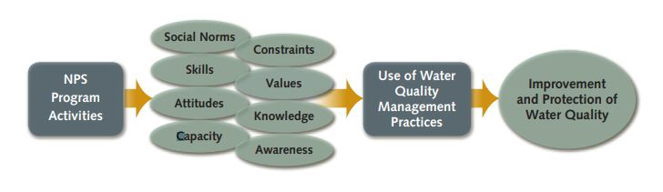

**Learning Objectives**

-   Review the origins of the study of human-environmental interactions in the social sciences
-   Explore theoretical perspectives and research questions studied by natural resource social scientists
-   Identify government agencies and nonprofit organizations that employ natural resource social scientists
-   Evaluate the role of social science research in monitoring and protecting the Great Lakes

------------------------------------------------------------------------

The restoration and protection of water resources is not solely a technical or ecological challenge. While natural science monitoring can identify pollutants, track ecological change, and evaluate restoration outcomes, it cannot fully explain why environmental degradation occurs in the first place - or why some management strategies succeed while others fail.

Social science research helps us understand why people believe and act in particular ways. This information is critical for developing programs, polices, and plans that members of the public will support. This is essential for creating solutions that effectively address environmental problems, and for analyzing where processes intended to meet public needs fall short or break down.

When it comes to watersheds, human actions play an outsized role in shaping environmental outcomes. Decisions about land use, infrastructure, waste disposal, and resource consumption are made by individuals, households, organizations, and governments. People, all the way down! Understanding these decisions requires tools that focus on humans, institutions, and social systems.

This chapter will familiarize you with social science research and how social scientists think about humans in the environment.

## Why Social Science?

Social science researchers study a broad range of topics related to human dimensions of societal issues. <abbr title="The study of human society."style="font-weight: bold; text-decoration: underline dotted; cursor: help;"> <em>Sociology</em> </abbr> is one subfield of the social sciences that is broadly defined as “the study of human society” (Conley, 2019: 5). That is, sociologists study the systems of organizations that groups of people create to provide for shared needs – things like public services, law and safety, and cultural institutions that create a cohesive group identity.

Sociologists are interested in understanding the meanings behind and consequences of people's preferences, values, social ties, and behaviors. The questions that sociological research asks about the world may include things like:

-   How do attitudes and values affect a person's behavior?
-   What are sources of bonding among a group of people?
-   Which factors are associated with a particular life outcome
-   Why do people prefer one policy option or plan over another?
-   What patterns can be observed in the way people think about or experience an issue?

Sociology emerged as an academic discipline in Europe during the mid-1800s, which was a really happening time! The Industrial Revolution pulled populations away from dispersed agricultural dwellings and concentrated them in dense urban settings. This transformed the way people lived, worked, played, and otherwise interacted.

Additionally, political revolutions in France and the United States demanded new forms of representative governance. At the same time, scientific understanding was ousting traditional religious authority and offering new explanations for everything from illness to natural disasters. With so much going on, early sociologists were concerned with how social cohesion, or a sense of community, would be maintained under societal transformation (Ritzer, 2011). What would hold people together under this new social order?

During these early days of the sociological discipline, Jane Addams, an American social scientist located in Chicago, co-founded a settlement house where she studied urban conditions and helped immigrant laborers in Chicago's urban core. Established in 1889, <abbr title="A site for community organizing, social services, and early sociological research, co-founded by Jane Addams in Chicago."style="font-weight: bold; text-decoration: underline dotted; cursor: help;"> <em>Hull House</em> </abbr> served as an organizing base and center for social services (before those formally existed) for immigrants experiencing housing shortages and overcrowding, brutal work conditions, and environmental illnesses. Researchers at the Hull House were some of the early investigators into problems associated with environmental pollution in working-class neighborhoods, workplace exposure to toxic chemicals, and the connection between public infrastructure and public health (Reyerson, 2021).

Although early sociological research documented environmental conditions and health impacts in industrial cities, most social scientists did not yet conceptualize the environment as a distinct area of study. Instead, environmental harms were embedded within broader analyses of industrialization, labor, and social inequality. This began to change as pollution and ecological degradation reached levels that could no longer be ignored.

## Human-Environment Relationships

For much of the early history of social science, environmental impacts were treated as secondary to economic development and social organization. However, by the 1960s, industrial production in U.S. cities had created severe environmental degradation, creating a tipping point and inspiring social movements that social scientists could not ignore. New theoretical perspectives were developed to explain the relationship between humans and the environment.

These ideas guided new fields of research and continue to shape how environmental problems are understood, as well as how management strategies are designed.

**The New Ecological Paradigm** is a perspective evaluating the extent to which a person's environmental worldviews prioritize the connection between humans and nature, and belief that society has ecological limits (Dunlap and Van Liere, 1978). This theory was used to develop a set of survey questions intended to measure whether individuals believe environmental degradation is a serious concern and whether they support environmental protection even when it restricts human activities. In watershed management, NEP helps explain variation in public concern for water quality and support for conservation efforts.

**The Treadmill of Production** perspective argues that modern capitalist societies are organized around continual economic growth, which requires increasing extraction of natural resources and generates growing amounts of pollution (Schnaiberg, 1980). According to this theory, governments, businesses, and workers often share an interest in expanding production, even when environmental consequences are well understood. Environmental degradation is therefore not simply the result of individual behavior, but of structural pressures embedded in economic and political systems. From this perspective, water quality problems persist because economic priorities repeatedly outweigh ecological concerns.

**Ecological Modernization** theory offers a more optimistic view of the relationship between economic development and environmental protection. Rather than seeing growth and environmental quality as inherently incompatible, this perspective emphasizes technological innovation, institutional reform, and policy tools that reduce environmental impacts while allowing economic activity to continue (Spaargaren & Mol, 1992; Siegel, 2019). Examples include improved wastewater treatment, cleaner production technologies, and incentive-based environmental policies. In watershed management, ecological modernization supports strategies that rely on infrastructure investment and regulatory improvement to achieve environmental goals.

**Environmental Justice** focuses on the unequal distribution of environmental harms and benefits across social groups. Research in this tradition documents how low-income communities and communities of color are more likely to be exposed to pollution and environmental hazards, while also facing barriers to accessing environmental amenities such as clean water and recreational spaces (Bullard, 1990). Environmental justice scholars emphasize that these patterns result from historical processes, policy decisions, and power imbalances rather than individual choices. In watershed contexts, this perspective draws attention to whose waterways are impaired, who benefits from restoration, and who participates in decision-making.

**The Theory of Planned Behavior** explains environmental actions by focusing on how individual decision-making is shaped by attitudes, social norms, and perceived behavioral control - or a person’s ability to act given available resources and constraints (Ajzen, 1991). In conservation research, this theory is often used to understand why people do or do not adopt recommended practices, even when they express environmental concern. Applied to watershed management, the theory highlights the importance of capacity, access, and social expectations in shaping conservation behavior (Prokopy et al., 2009).

Each of these perspectives highlights different dimensions of environmental problems and suggests different approaches to management. No single theory fully explains the complexity of watershed management challenges. In practice, social scientists and environmental managers often draw on insights from multiple perspectives to better understand stakeholder behavior, anticipate conflict, and design more effective and equitable management strategies.

## Social Indicators of Conservation

Watershed management often relies on voluntary adoption of best management practices, public participation, and coordination across jurisdictions. As a result, understanding public awareness, attitudes, and constraints is essential.

A watershed management plan identifies threats to a watershed and outlines a comprehensive strategy for addressing them. Without social science input, management efforts risk overlooking key barriers to implementation or misaligning strategies with community values.

One response to this need for integrating social science data in watershed planning is the Social Indicators Planning and Evaluation System (SIPES), which standardizes data collection across Great Lakes watersheds (Genskow and Prokopy, 2011).

SIPES measures <abbr title="Standardized survey questions that provide social science data for use in watershed planning."style="font-weight: bold; text-decoration: underline dotted; cursor: help;"> <em>social indicators</em> </abbr> of conservation management, including:

-   Awareness of threats to water resources
-   Attitudes about the importance of conservation practices
-   Capacity to implement best management practices
-   Barriers that prevent adoption

{fig-alt="A diagram showing relationships between factors in the Theory of Planned Behavior framework used by SIPES."}

This information is used in watershed planning to learn about people’s understanding of their impacts to water resources, and develop outreach and education plans that bridge knowledge gaps and frame the importance of conservation behaviors in terms that resonate with a particular community’s water values. By pairing ecological data with social indicators, watershed managers can develop more effective and context-specific strategies for improving water quality.

Social scientists contribute to watershed and natural resource management in a variety of institutional settings. They conduct research, outreach, and engagement through employment by universities, public policy institutes, and governmental agencies. Some examples include the USDA Economic Research Service, the U.S. Forest Service, and the National Park Service.

## Summary

Social science research helps explain why people think, behave, and make decisions in particular ways, and why environmental policies and management strategies succeed or fail in practice. Because human actions play an outsized role in shaping environmental conditions, the social sciences provide essential tools for understanding environmental problems and designing responses that are socially feasible as well as ecologically effective.

Theoretical perspectives such as the New Ecological Paradigm, Treadmill of Production, Ecological Modernization, Environmental Justice, and the Theory of Planned Behavior offer different lenses for interpreting human–environment relationships. Each emphasizes distinct drivers of environmental change, ranging from individual values and beliefs, to economic structures, technological systems, institutional arrangements, and social inequalities. Together, these theories highlight that environmental problems are not solely technical or scientific challenges, but are deeply embedded in social systems.

In watershed management, social science theories help clarify why stakeholders hold different priorities, why some conservation practices are adopted while others are resisted, and how power, resources, and capacity shape management outcomes. To support applied decision-making, standardized social indicators provide a way to systematically measure public awareness, attitudes, and constraints across communities. When combined with ecological data, these approaches enable managers to better evaluate tradeoffs, anticipate conflict, and design more effective and collaborative management strategies.

## Reflection Questions

1.  **Different theories highlight different causes of environmental problems.** Which theoretical perspective do you find most convincing for explaining water quality challenges in the Great Lakes, and why?
2.  **Sociological theories operate at different levels, from individual behavior to social institutions and power structures.** How does the level of analysis used by a theory influence the types of management strategies it suggests?
3.  **Watershed management often involves disagreement among stakeholders.** How might different theories help explain why stakeholders disagree about solutions, even when they share concern about water quality?
4.  **Social indicators are used to measure attitudes, awareness, and constraints.** Which aspects of human behavior or decision-making do you think are most important to measure when evaluating watershed management efforts?

## References

::: references
-   Ajzen, I. (1991). The theory of planned behavior. Organizational Behavior and Human Decision Processes, 50(2), 179-211. <https://doi.org/10.1016/0749-5978(91)90020-T>.

-   Bullard, R. D. (1990). Dumping in Dixie: Race, Class, and Environmental Quality. Boulder, CO: Westview Press.

-   Conley, D. (2019). You May Ask Yourself: An Introduction to Thinking Like a Sociologist, 6th edition. New York: W.W. Norton.

-   Dunlap, R. E., & Van Liere, K. D. (1978). The "New Environmental Paradigm": A proposed measuring instrument and preliminary results. Journal of Environmental Education, 9(4), 10-19. <https://doi.org/10.1080/00958964.1978.10801875>.

-   Genskow, K. and Prokopy, L. (eds.). (2011). The Social Indicator Planning and Evaluation System (SIPES) for nonpoint source management: A handbook for watershed projects. 3rd edition. Great Lakes Regional Water Program. (104 pages).

-   Prokopy, L. S., Genskow, K. D., Asher, J., Baumgart-Getz, A., Bonnell, J.E., Broussard, S., Curis, C., Floress, K., McDermaid, K., Power, R., & Wood, D. (2009). Designing a regional system of social indicators to evaluate nonpoint source water projects. Journal of Extension, 47(2): 2FEA1.

-   Reyerson, J.(2021). Hull House and the garbage ladies of Chicago." National Park Service. Accessed December 12, 2024 <https://www.nps.gov/articles/000/hull-house-and-the-garbage-ladies-of-chicago.htm>.

-   Ritzer, G. (2011). Sociological Theory, 8th edition. New York: McGraw-Hill.

-   Schnaiberg, A. (1980). The Environment: From Surplus to Scarcity. New York: Oxford University Press.

-   Siegel, L. B. (2019). Fewer, Richer, Greener: Prospects for Humanity in an Age of Abundance. Wiley.

-   Spaargaren, G., & Mol, A. P. J. (1992). Sociology, environment, and modernity: Ecological modernization as a theory of social change. Society & Natural Resources, 5(4), 323-344. <https://doi.org/10.1080/08941929209380797>.
:::
