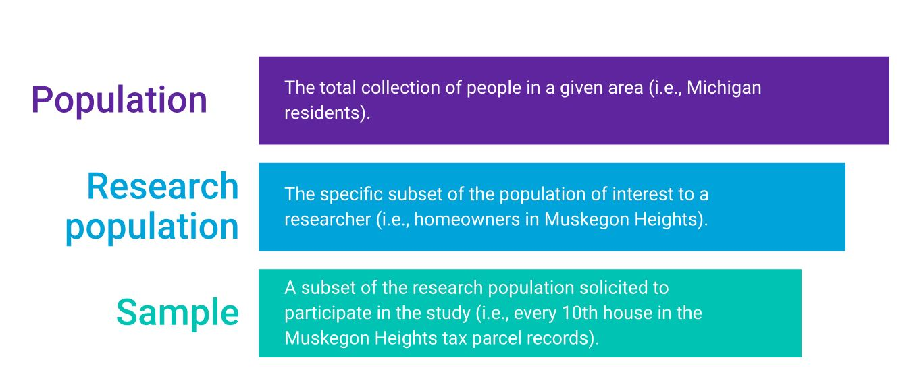
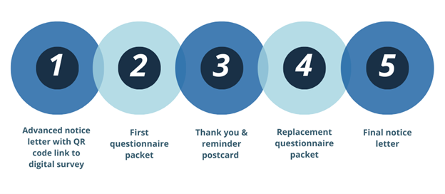
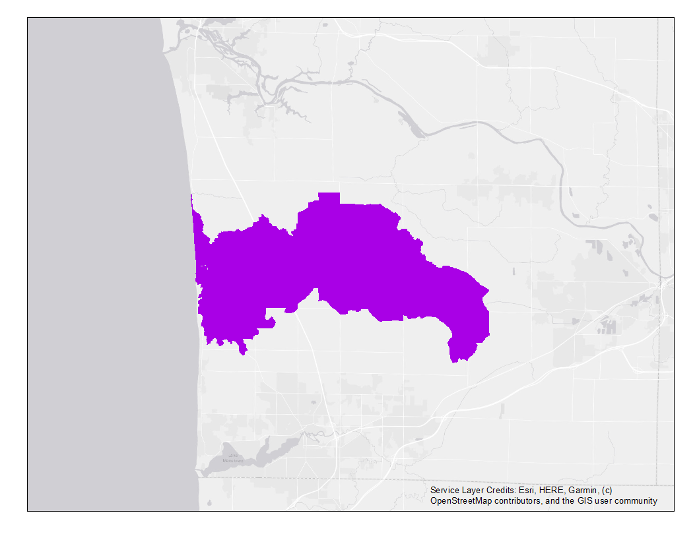
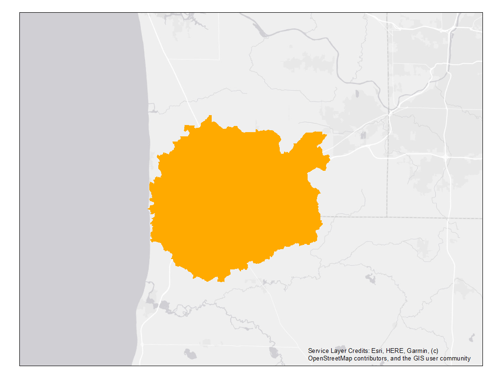
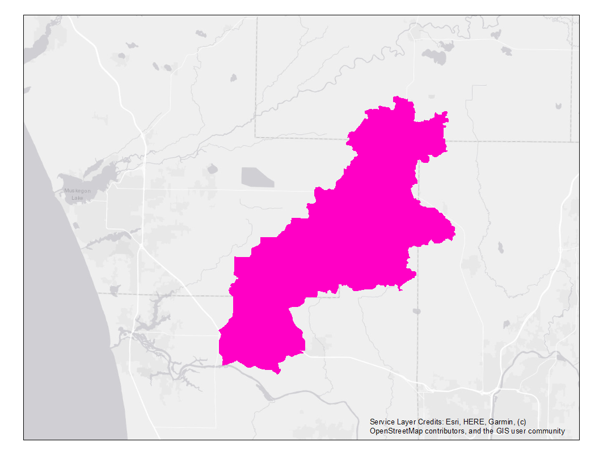
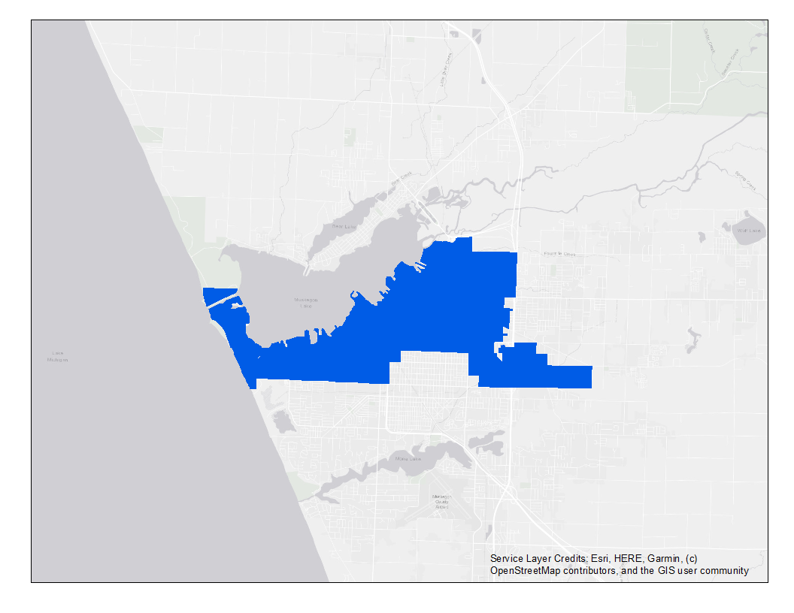
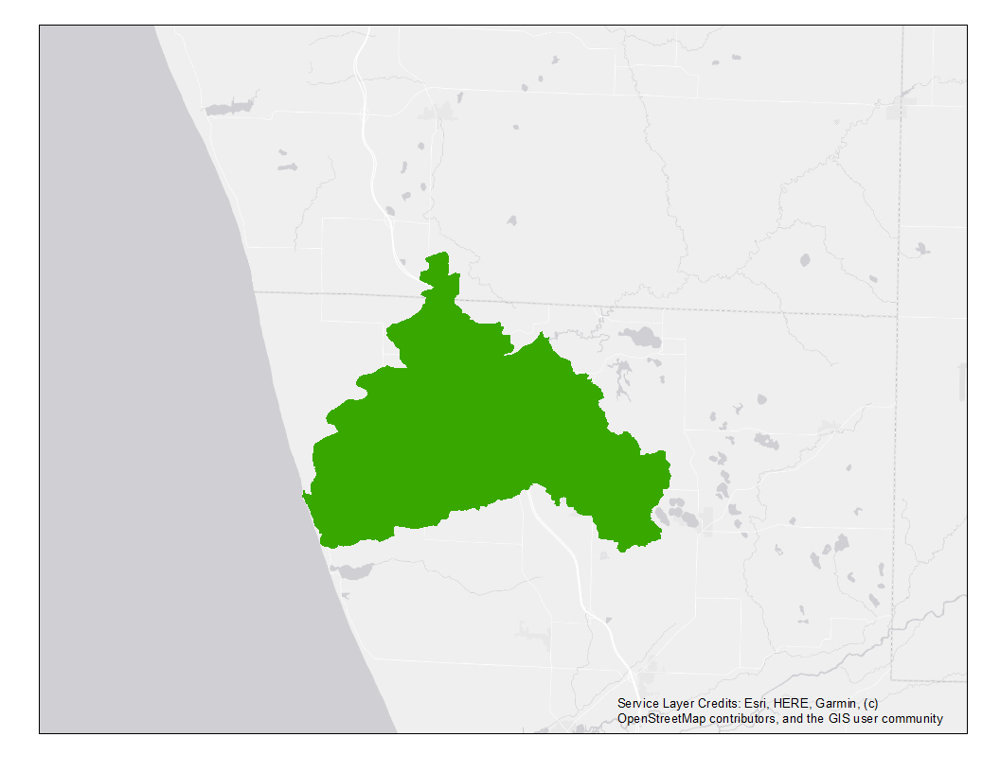
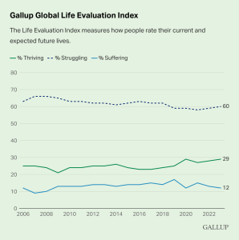
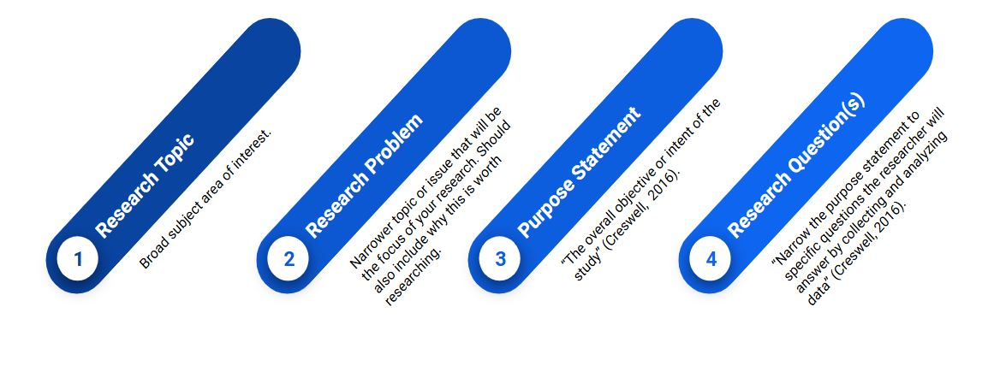

**Learning Objectives**

-   Review questionnaire design and distribution, WMW Database
-   Identify sources of measurement error and bias in research design
-   Review the geographic settings of the research sites and related management goals
-   Identify concepts operationalized by survey questions in the West MI Watersheds database
-   Identify elements of appropriate research questions

------------------------------------------------------------------------

In the previous chapter, we examined how social science data is being integrated into watershed management plans developed by organizations across the Great Lakes Basin. The [Social Science Lab](https://www.gvsu.edu/socialsciencelab/) is an applied research center at GVSU that helps people solve problems using stakeholder data.

From 2020-2023, the Social Science Lab conducted seven surveys with five different community partners to inform regional watershed planning. Phew! We dubbed this collection of survey data from landowners in watersheds up and down the eastern Lake Michigan shoreline the "West MI Watersheds Database." Each watershed in the database had different management challenges and each partner had different management goals. Additionally, different undergraduate student researchers were employed throughout the projects, each with different research interests. Therefore, the seven surveys had some commonalities as well as some distinctions.

{fig-alt="Inset map showing enlarged images of watersheds in the West MI Watersheds database."}

We will use this collection of surveys from area residents to gain experience with entry-level data management, analysis, and reporting that is applicable to a wide range of professional settings. Some day, if you are asked to create a report incorporating quantitative performance data, customer satisfaction evaluations, stakeholder assessments, or budget expenditures and/or projections, you will be prepared to slay these data science tasks with confidence.

We'll start by reviewing the research methodology used to collect the data, then we'll dig into the locations and measures included. This information will help you design the research questions you'll explore this semester.

## Survey Methods

If you have ever had the pleasure of preparing 10,000 pieces of mail under a deadline, perhaps you can appreciate the investment that former generations of Lakers made in building the West MI Watersheds Database. The fruits of their labor produced an organized, verified, documented dataset that will serve as a sandbox for our data explorations this semester. While we can't reproduce the full experience in the span of 15 short weeks, it’s important to understand the methodology employed to collect the data we’ll analyze.

<abbr title="Techniques and tools used to collect and analyze data."style="font-weight: bold; text-decoration: underline dotted; cursor: help;"> <em>Research methods</em> </abbr> are techniques used to collect data and, in the social sciences, analyze phenomena related to the social world. In the social sciences, research methods may be quantitative, qualitative, or a mix of both methods.

| Quantitative Methods | Qualitative Methods |
|------------------------------------|------------------------------------|
| Tests a hypothesis | Uncovers deeper meaning |
| Measures created systematically before data collection | Measures specific to the individual setting |
| Data in numeric form | Data from texts, images, observations, and/or transcripts |
| Procedures standardized, replication assumed | Procedures particular and replication is difficult |
| Analysis uses statistics to test relationships between variables | Analysis identifies themes and patterns |

|  |
|------------------------------------------------------------------------|
| Read more: [*Research Methods for Social Sciences*](https://pressbooks.bccampus.ca/jibcresearchmethods/chapter/3-5-quantitative-quantitative-mixed-methods-research-approaches/) |

Among quantitative research methods, survey research refers to the use of standardized questionnaires or interviews to collect data that are converted to numeric values for statistical analysis (Bhattacherjee, 2012: 73).

We are all familiar with surveys because this method is so commonly used to collect data. From social science research, to consumer satisfaction or user experience surveys, and even course evaluations - you are probably asked to fill out a survey every time you turn around! Most surveys include a <abbr title="A small number of individuals who are systematically selected to participate in the study."style="font-weight: bold; text-decoration: underline dotted; cursor: help;"> <em>sample</em> </abbr> of people, which is a small number of individuals from the <abbr title="Everyone who is impacted by or related to the subject of the study."style="font-weight: bold; text-decoration: underline dotted; cursor: help;"> <em>population</em> </abbr> who are systematically selected to participate in a study.

For example, rather than mailing a survey to all 10,000 residents in the Pigeon River watershed, which would be very expensive, we obtained a list of all property owners in the watershed and used a random number generator to draw a sample of 900 residents, who were mailed a copy of the survey.

In this example, there are three population scales we can consider. First, there is the broader population of all Michigan residents, from within which we are interested in Pigeon River watershed residents - our research population. The subset of 900 Pigeon River residents who were randomly selected to receive a questionnaire in the mail represents the research sample.

{fig-alt="Diagram defining the population (the total collection of people in a given area), the research population (the specific subset of the population of interest to the researcher), and the sample (A subset of the research population selected to participate)."}

There are a variety of <abbr title="The systematic method used to determine who is eligible to participate in a study."style="font-weight: bold; text-decoration: underline dotted; cursor: help;"> <em>sampling techniques</em> </abbr> used in survey research.

Probability sampling is common in quantitative research because it enables researchers to generalize results from the sample to a broader population. For example:

-   **Random Sampling:** All individuals in the defined population of interest have an equal chance of being selected to participate in the study. This ensures generalizability of the sample to broader populations. Learn more in the Pew Research Center video, *Methods 101: Random Sampling.*

<iframe width="560" height="315" src="https://www.youtube.com/embed/sonXfzE1hvo?si=WHzIJbpHCR__0Nww" title="YouTube video player" frameborder="0" allow="accelerometer; autoplay; clipboard-write; encrypted-media; gyroscope; picture-in-picture; web-share" referrerpolicy="strict-origin-when-cross-origin" allowfullscreen>

</iframe>

To draw a random sample that can be generalized to a broader population (the research population), the researcher must have a complete list of all people that belong to the research population. This is known as the <abbr title="A list of all members of the research population from which a sample is drawn."style="font-weight: bold; text-decoration: underline dotted; cursor: help;"> <em>sampling frame.</em> </abbr> If the sampling frame is incomplete or does not accurately represent the population of people of interest to the research questions, the survey results cannot be said to represent the average experience of that population, no matter how many responses the researcher receives. Common lists used to draw sampling frames include tax parcel records of property owners, email addresses for organization/institution members, client lists for service providers, phone numbers (more problematic due to cell phones and unlisted numbers).

In contrast, nonprobability sampling is common in qualitative research because the goal of the research is in-depth description rather than generalization. Nonprobability sampling techniques include:

-   **Convenience Sampling:** Reliance on people who are available to the researcher(s), have important insight on the topic, and are willing to participate.

-   **Snowball Sampling:** Method of recruitment based on referral by other research participants.

-   **Purposive Sampling:** Respondents selected because of specific characteristics related to the goals of the research.

The surveys included in the West MI Watersheds Database utilized the <abbr title="A method of survey design that increases participation by reducing costs, increasing benefits, and inspiring trust."style="font-weight: bold; text-decoration: underline dotted; cursor: help;"> <em>Tailored Design Method</em> </abbr>, a strategic approach to survey design developed by [Don Dillman](https://sesrc.wsu.edu/about/total-design-method/) to increase participation in survey research. In a perfect world, everyone would be thrilled that you bothered to ask them what they think, need, or experience day-to-day. In the real world, getting people to complete a survey can be extremely challenging.

The Tailored Design Method emphasizes 1) social exchange theory; 2) personalized, frequent contacts; and 3) allowing multiple response modes. Let's break each component down.

**Social exchange theory** assumes that people are more likely to respond to a request to complete a survey if the perceived rewards or benefits of participating outweigh the perceived costs. Researchers can reduce costs/increase rewards by:

-   Asking interesting questions
-   Making questionnaires easy to navigate
-   Providing cash incentives
-   Explaining the importance of the research

**Personalized correspondence** helps instill trust and legitimacy by:

-   Addressing the recipient by name
-   Providing the researcher’s credentials
-   Expressing gratitude and deference
-   Letting the recipient know that other responses have been helpful

Five contact attempts are recommended at 1-2 week intervals, with the type of contact varying each time to capture attention. For example, potential survey participants first receive a letter explaining the study and notifying them that a survey is coming. They next receive a paper survey packet with a postage paid return envelope. This is followed by a post card thanking people who have responded and reminding those who have not sent back their completed packet to do so. If the project budget allows, a replacement survey packet is sent 1-2 weeks later, followed by a final letter notifying recipients that the study is coming to a close and requesting that they mail back their completed surveys.

{fig-alt="A graphic illustrating the five waves of survey mailing, starting with an advanced notice and concluding with a final notice letter."}

Greater rates of response can be achieved using mixed modes of collection that allow respondents multiple options for completing the survey. Conventionally, this has been done using a combination of mail and phone surveying. Increasingly, mail surveys are offering a digital completion option.

Survey error is the difference between an estimate produced by survey data and the true value of the variables in the study population (Dillman, 2014). Four types of error can compromise the accuracy of survey results.

-   **Coverage error:** occurs when the list from which the survey sample was drawn did not accurately represent the study’s target population.
-   **Sampling error:** occurs any time a sample of units is used to produce estimates instead of surveying every unit; some difference between the sample and the population is always expected.
-   **Nonresponse error:** occurs when people who do not respond to a survey are different from those that do respond.
-   **Measurement error:** occurs when respondents are unable to give accurate answers because of poor questionnaire design.

When executed effectively, survey research can tell us a lot about a population of interest by only getting input from a small subset of that population. Being aware of common sources of error in survey design can help us identify (and avoid!) methodological problems that could compromise the integrity of survey data.

## Survey Sites

The data available in the West MI Watersheds Database cover several broad conceptual categories, varying by survey location and the information needs of the community partner sponsoring the project. In this section, we'll review the partners, purpose, and priorities covered by surveys conducted in each watershed.

------------------------------------------------------------------------

```{=html}

```

**The Pigeon River watershed (PRW)** stretches across 65 square miles of land in Ottawa County, MI and is a collection of small town and rural communities. The PRW faces management challenges related to NPS pollutants, with *E. coli* pollution (i.e., fecal contamination) and sedimentation being primary concerns.

In June 2020, the Ottawa Conservation District partnered with the GVSU Social Science Lab to conduct a survey of residential homeowners and farmers in the Pigeon River watershed. The goal of the survey was to inform the creation of a watershed management plan (OCD, n.d.). We therefore asked landowners about their knowledge of water quality and sources of water pollution, use of BMPs for protecting water quality, and interest in participating in future cost share programs. The survey was mailed to 900 property owners in the PRW. A total of 300 completed responses were received.

::: clear
:::

------------------------------------------------------------------------

```{=html}

```

**The Macatawa watershed (MAC)** encompasses 175 square miles of land in Ottawa and Allegan Counties and is characterized by diverse land uses, including intensive residential/commercial development and agricultural operations. The watershed is plagued by high levels of phosphorus pollution from fertilizer runoff and wetland loss that contribute to algal blooms and render the lake hypereutrophic (Iavorivska et al., 2021).

In January 2021 the Project Clarity partners worked with the GVSU Social Science Lab to survey Macatawa Watershed residents about water quality and sources of pollution in the watershed, property management practices, general knowledge about the watershed, willingness to pay for water quality improvements, and participation in Project Clarity initiatives. The survey was mailed to 1,200 property owners in the Macatawa watershed. A total of 327 completed responses were received.

::: clear
:::

------------------------------------------------------------------------

```{=html}

```

**Crockery Creek (CCS)** is the largest tributary to the Lower Grand River watershed, serving as the drainage basin for 102,318 acres of predominantly agricultural land in Muskegon, Ottawa, Newaygo, and Kent Counties. Crockery Creek has historically had problems with erosion, which is concerning because sedimentation raises water temperatures and creates a threat to habitat in this treasured local coldwater trout stream. Additionally, fecal contamination is a persistent problem in the watershed, with Crockery Creek having a total maximum daily load (TMDL) target for *E. coli* bacteria dating back to 2003 (LGROW, 2010).

The Crockery Creek Speaks (CCS) survey was conducted from June - August, 2022 as part of the Ottawa Conservation District’s Crockery Creek and Sand Creek restoration project. This community survey gathered input from rural residents and farmers living in the Crockery Creek watershed about their thoughts on the status and management of local water quality, as well as the accessibility of recreational activities along the creek and residents' values of wetlands. The survey was mailed to 2,500 property owners and 323 completed questionnaires were returned.

::: clear
:::

------------------------------------------------------------------------

```{=html}

```

**Muskegon Lake (MML)** is a 4,149-acre drowned river mouth lake on the eastern shore of Lake Michigan and was delisted as a Great Lakes AOC in 2025 (US EPA, N.d.). With this exciting milestone achieved, interest in preserving public access during recreation and redevelopment is coming to the forefront for community groups.

In March 2021 the Muskegon Lake Watershed Partnership and the West MI Shoreline Regional Development Commission partnered with the GVSU Social Science Lab to survey City of Muskegon residents about recreational activities at Muskegon Lake, perceptions of the lake’s AOC restoration, and satisfaction with features at lakeshore public access sites. The My Muskegon Lake (MML) survey was mailed to 1,860 households. A total of 294 completed responses were received.\

::: clear
:::

------------------------------------------------------------------------

```{=html}

```

**White Lake (MWL)** is a 2,571-acre drowned river mouth lake and a former Great Lakes AOC that was delisted in 2014. The area includes two small cities, Whitehall and Montague, and rural farmland. With all BUIs restored and many redevelopment project completed, White Lake is a popular tourist destination (US EPA, N.d.).

In May 2021, Rylie Dorman (GVSU NRM alumna) received a [Student Summer Scholar’s](https://www.gvsu.edu/ours/ssp/student-summer-scholars-program-81.htm) award to conduct an independent study of perceptions of lakeshore restoration and recreational use among residents in the White Lake Area. The My White Lake (MWL) survey was distributed to 1,200 households from June - August. In total, 319 completed surveys were returned. Dorman's comparison of MWL and MML survey results was published in the *Journal of Great Lakes Research* (Dorman et al., 2023). Go Rylie!

::: clear
:::

------------------------------------------------------------------------

```{=html}

```

**The Little Manistee River watershed (MAN)** serves as the drainage basin for 145,280 acres of land in Lake, Manistee, Mason, and Wexford Counties. The “Little River” is valued for its abundant trout and steelhead fish, spectacular scenery, and exciting canoeing (LMWCC, 2022). Steelhead eggs from the Little Manistee are harvested by the Michigan Department of Natural Resources (DNR) to stock rivers across the state (Bullen, N.d). The watershed is sparsely populated, with small villages dotting a landscape of forest and farmland until the river reaches Manistee Lake and the City of Manistee.

The Little Manistee Management Survey was conducted by the Social Science Lab on behalf of the Little Manistee Watershed Conservation Council (LMWCC) to gather input from watershed residents on local water quality and a proposed DNR Natural Rivers Program designation for the Little Manistee River. The survey was mailed to 1,503 property owners and stakeholders in the Little Manistee River watershed from July-September 2023. We received completed questionnaires from 531 respondents.

::: clear
:::

------------------------------------------------------------------------

```{=html}

```

**The Pentwater River watershed (PENT)** contains 166 square miles of land in Oceana and Mason Counties. The surrounding landcover is a mix of farmland and forests. The North Branch of the watershed has historically had high quality water resources, with large wetland areas providing habitat for a healthy fishery and abundant wildlife (Pentwater Lake Association, n.d.).

The Social Science Lab conducted the Pentwater Watershed Planning Survey on behalf of the Friends of the Pentwater River Watershed (Friends), from November-December 2023. The purpose of the survey was to assess landowner knowledge, attitudes, and property management actions related to water quality to inform updates to the watershed's management plan. The survey was mailed to 850 property owners in the Pentwater River watershed. We received completed questionnaires from 168 landowners.

::: clear
:::

------------------------------------------------------------------------

This description of the unique geographic features and primary land uses of research sites in the West MI Watersheds Database will help you decide on the location(s) to focus on in your analysis. Additionally, the background information we reviewed about the project partners for each survey and the management goals for which they were seeking information will help you understand the measures used to conduct the survey. It is to these topics that we turn next.

## Survey Measures

Survey research produces structured responses that allow researchers to represent people’s experiences, behaviors, and perceptions in a systematic way. As we'll see in later chapters, these responses form the basis for statistical analysis.

In the social sciences, <abbr title="Characteristics that can take on different values."style="font-weight: bold; text-decoration: underline dotted; cursor: help;"> <em>variables</em> </abbr> refer to characteristics of people (or related phenomena) that differ, or vary. For example, age is a characteristic of individuals that varies and meaningfully impacts how people experience the world.

Level of knowledge about threats to water quality is another characteristic that can vary in a research population. Within the variable "water quality knowledge," we may have different <abbr title="Properties of a variable."style="font-weight: bold; text-decoration: underline dotted; cursor: help;"> <em>attributes</em> </abbr> that describe an individual's level of knowledge, from "not at all" knowledgeable to "very" knowledgeable.

Importantly, not all characteristics are equally easy to observe or measure. Many of the things that social scientists care about in water research (e.g., stewardship values or connection to nature) exist as shared understandings or internal states rather than directly observable behaviors. Before we can decide how to analyze these characteristics statistically, we first have to think carefully about what they mean and how they can be represented in data.

Age is a fairly straightforward characteristic to measure. We can easily ask people their year of birth or age and know that we all understand this as a measure of the number of years an individual has been alive. However, "level of knowledge" about something is a wee bit of a mushier measure. These more abstract things that social scientists often measure are called <abbr title="Measures in social science research that are not observable, directly or indirectly."style="font-weight: bold; text-decoration: underline dotted; cursor: help;"> <em>constructs</em> </abbr>.

```{=html}

```

Constructs can't be observed directly with the naked eye or indirectly, as in our example of asking someone their date of birth to measure age. Instead, constructs must be <abbr title="The process by which we spell out precisely how a concept will be measured."style="font-weight: bold; text-decoration: underline dotted; cursor: help;"> <em>operationalized</em> </abbr> through a process of defining the concept one wishes to measure, specifying the research procedures we will use to gather data about our concepts, and identifying indicators that will be taken to represent the ideas that we are interested in studying. As an example, use this link to learn how Gallup, an internationally renowned research firm, measures the concept "well-being" pictured in the graphic at right: [Gallup Global Life Evaluation Index](https://news.gallup.com/poll/122453/Understanding-Gallup-Uses-Cantril-Scale.aspx).

::: clear
:::

As you may have guessed, developing indexes that operationalize abstract constructs is a difficult job to do well. Firms like Gallup use measures that have been tested, refined, experimented with, and iteratively developed over many years. This helps social science researchers achieve greater <abbr title="Achieving consistency in measurement, such that if the same measure is applied consistently to the same person, the result will be the same each time."style="font-weight: bold; text-decoration: underline dotted; cursor: help;"> <em>reliability</em> </abbr> with our measures, meaning that we are achieving a consistent level of measurement from one research participant to the next, and <abbr title="Achieving certainty that our measures accurately get at the meaning of our concepts."style="font-weight: bold; text-decoration: underline dotted; cursor: help;"> <em>validity</em> </abbr>, which means that we are measuring what we intend to measure.

The variables available in the West MI Watersheds Database cover several broad conceptual categories and vary by survey location. To get the best sense of the information available within each dataset, you will need to spend some time browsing the copies of questionnaires presented to survey respondents. A rough summary of the concepts for which there are measures available within each watershed follows.

| Concepts Measured | Available Datasets |
|------------------------------------|------------------------------------|
| Water-based recreational activities | PRW, MAC, CCS, PENT, MAN, MML, MWL |
| Stewardship attitudes | PRW, MAC, CCS, PENT, MAN, MML, MWL |
| Perceptions of water quality and impairment | PRW, MAC, CCS, PENT, MAN, MML, MWL |
| Use of BMPs | PRW, MAC, CCS, PENT, MAN |
| Information sources | PRW, MAC, CCS, PENT, MAN |
| Trust in management agencies | PRW, MAC, CCS, PENT, MAN |
| Perception of neighborhoods | MML, MWL |
| Visits to lake | MML, MWL |
| Attachment to neighborhood/lake | MML, MWL |
| Opinions about AOC impacts | MML, MWL |
| Demographic characteristics of participants | PRW, MAC, CCS, PENT, MAN, MML, MWL |

Now that you have an understanding of how the West MI Watersheds data were collected, the research sites included, and the concepts the survey measures, you can take the first important step of crafting your inquiry: defining your research questions.

## Research Questions

Establishing clearly defined <abbr title="Empirical questions that can be answered by observable experiences."style="font-weight: bold; text-decoration: underline dotted; cursor: help;"> <em>research questions</em> </abbr> at the outset of a study is important for focusing the research and providing direction for the path a project will take.

The research questions determine the scope of the project, define a target population who will become the subject of inquiry, and ultimately determine which methods of research and analysis are appropriate. Ensuring that research questions are conceptually clear and specific is a foundational step that grounds the project and provides direction for the work ahead (DeCarlo, 2018).

Research questions have a specific objective, which ranges from explaining to describing (Sheppard, 2020; DeCarlo, 2018). In general, research questions:

-   Are written in the form of a question
-   Are clear and focused
-   Cannot be answered with, “Yes” or “No”
-   Have more than one possible answer
-   Explore relationships among multiple concepts

It is often helpful to situate your research in a broader context before you start writing your research questions. This helps you work from mushy to focused while keeping your project connected to the purpose you hope to achieve. This process is visually depicted below.

{fig-alt="Graphic listing defining the topic, defining the research problem, defining a purpose statement, and defining the research question."}

First, you'll start with naming the broad topic that your research will focus on, such as "lake recreation." Next, you'll narrow this broad topic to a specific problem serving as the focus of your research - let's try "barriers to participating in lake recreation." In this example, my purpose might be something like "identifying factors that facilitate or impede equal access to enjoyment of recreational activities at the lake." This helps me finally arrive at a focused research question: What factors limit Muskegon residents' access to recreational activities at Muskegon Lake?

After narrowing the research topic to the central research question, keep these four suggestions for writing research questions in mind:

1.  Begin the question with how, what, or why
2.  State the core idea, or phenomenon, that you want to investigate
3.  Identify the population of interest, from whom the data was collected
4.  Identify the research site, or place the study was conducted

Remember that you are writing a research question, not a statement. Your research question is not "best management practices," but it might be, "Which residents in the Pigeon River watershed use best management practices?" As we've already established, you'll also need to take care in your choice of words to focus your question appropriately. This is not the time for wordiness and eloquence. Every word in your research question should be carefully selected to reflect the meaning of your question. Keep your word choice un-fancy (Sheppard, 2020; DeCarlo, 2018).

However, don't confuse focused language with conceptual simplicity - your research question needs to be sufficiently complex so as to not be answered with a simple "yes" or "no". You won't have an awful lot to say if that's all it takes to answer your question! In the examples above, I'm not just asking, "Do Muskegon residents visit Muskegon Lake?" I'm asking about relationships between visitation and characteristics of residents, or how and to what extent other factors limit Muskegon Lake visitation. There should be more than one potential answer to your question. Your goal is to evaluate the relationship among several concepts that potentially explain the problem you are investigating (DeCarlo, 2018).

Below, you will find examples of problematic research questions and suggestions for how to improve each research question, adapted from Sheppard (2020).

------------------------------------------------------------------------

::::: columns
::: column=0.5
**Too narrow:**\
How many septic tanks were registered in the Pentwater River watershed in 2017?

*This topic is too narrow because it can be answered with a simple statistic.*
:::

::: column=0.5
**Improved:**\
What factors lead individuals to choose to have their septic systems inspected in the Pentwater River watershed?

*This question demonstrates the correct amount of specificity and results would provide the opportunity for an argument to be formed.*
:::
:::::

------------------------------------------------------------------------

::::: columns
::: column=0.5
**Unfocused and too broad:**\
What are the effects of pollution on watersheds in Michigan?

*This question is so broad that the research methodology would be very difficult. It is also too broad to be discussed in a typical research paper.*
:::

::: column=0.5
**Improved:**\
What are the health effects of *E. coli* pollution exposure among children in the Crockery Creek watershed?

*This question has a very clear focus for which data can be collected, analyzed, and discussed.*
:::
:::::

------------------------------------------------------------------------

::::: columns
::: column=0.5
**Too objective:**\
How much money does the average Lake Macatawa watershed resident spend on water-related recreation?

*This question may allow the researcher to collect data but does not lend itself to collecting data that can be used to create an argument because the data is just factual information.*
:::

::: column=0.5
**Improved:**\
What is the relationship between willingness to pay for water recreation and age among residents in the Lake Macatawa watershed?

*This is a more subjective question that may lead to the formation of an argument based on the results and analysis of the data.*
:::
:::::

------------------------------------------------------------------------

::::: columns
::: column=0.5
**Too simple:**\
What are municipal governments doing to address the problem of littering at parks?

*This information can be obtained without the need to collect unique data. The question could probably be answered with an online search and does not provide an opportunity for analysis. The use of the word “problem” is leading, as it assumes there is a problem with littering.*
:::

::: column=0.5
**Improved:**\
What is the relationship between perceptions that littering is a “severe” pollution issue at parks in Muskegon and the number of trash cans present at each park?

*This question is more complex and requires both investigation and evaluation. This will lead the researcher to produce more valuable and specific research.*
:::
:::::

------------------------------------------------------------------------

Remember the important direction provided by taking the time to establish clear research questions at the start of a project. When research questions are too broad, the researcher can become quagmired and lose their sense of purpose. Too narrow, and the researcher can become bored or fail to uncover novel insights. In survey research, the research questions guide who is asked to complete the study, what they are asked, and how the data are analyzed - importantly shaping each stage of the project.

## Summary

The West MI Watersheds Database brings together survey data collected across diverse watersheds, each shaped by distinct geographic features, land uses, and management priorities. Understanding these contextual differences and the methodology used to build each dataset is essential for making informed decisions about which watershed or watersheds to focus on in your analysis.

Equally important is understanding how survey questions translate complex social concepts into data. Many of the concepts central to watershed research, such as knowledge, attitudes, trust, or stewardship, are not directly observable. These abstract ideas must be carefully operationalized through specific questions and response options that serve as indicators of the underlying concept. Reviewing the survey instruments associated with each watershed provides critical insight into what was measured, how it was measured, and the kinds of inferences the data can reasonably support.

This information will help you build clearly defined research questions that will guide your decisions about which datasets to use, which variables to focus on, and how results are interpreted. Taking the time to create thoughtfully constructed research questions will help keep your analysis focused and ensure that your data explorations will meaningfully inform real-world management needs.

## Reflection Questions

1.  **The West MI Watersheds Database brings together data from watersheds with different geographic features, land uses, and management priorities.** How might these contextual differences shape the kinds of questions researchers can ask or the conclusions they can draw from the data?
2.  **Survey research is often used to understand public perceptions, behaviors, and attitudes related to water resources.** What advantages do surveys offer for watershed management, and what limitations should researchers and managers keep in mind when interpreting survey results?
3.  **Many of the concepts measured in watershed surveys are not directly observable.** Why does this make careful measurement especially important, and what risks arise when complex concepts are measured too simplistically?
4.  **Research questions link watershed context, survey design, and data analysis.** How might poorly defined research questions limit the usefulness of survey data for informing real-world management decisions?

## References

::: references
-   Bhattacherjee, A. (2012). Social Science Research: Principles, Methods, and Practices Textbooks Collection. 3. <https://digitalcommons.usf.edu/oa_textbooks/3>.
-   Bullen, W. H. N.d. The trout streams of Michigan: The Little Manistee River. Michigan Department of Natural Resources, Institute for Fisheries Research Archive. Retrieved November 17, 2023 <https://quod.lib.umich.edu/f/fishery/4986997.0074.002?rgn=main;view=fulltext>.
-   Çetinkaya-Rundel, M. and Hardin, J. (2024). Introduction to Modern Statistics, 2e. OpenIntro. CC-SA 3.0 <https://openintro-ims.netlify.app/>.
-   Creswell, J.W. (2016). 30 Essential Skills for the Qualitative Researcher. Sage.
-   DeCarlo, M. (2018) Scientific Inquiry in Social Work. Pressbooks. CC-BY-BC-SA 4.0. <https://pressbooks.pub/scientificinquiryinsocialwork/>.
-   Dillman, D. A., Smyth, J. D., & Christian, L. M. (2014). Internet, Phone, Mail, and Mixed-Mode Surveys: The Tailored Design Method (4th ed.). John Wiley & Sons.
-   Dorman, R., Buday, A., Woznicki, S., DeVasto, D., and Fergen, J. (2023). Great Lakes for whom?: Community outcomes in the Muskegon and White Lake Areas of Concern. Journal of Great Lakes Research, 49(5): 1166-1178 <https://doi.org/10.1016/j.jglr.2023.07.008>.
-   Iavorivska, L., Veith, T. L., Cibin, R., Preisendanz, H. E., & Steinman, A. D. (2021). Mitigating lake eutrophication through stakeholder-driven hydrologic modeling of agricultural conservation practices: A case study of Lake Macatawa, Michigan. Journal of Great Lakes Research, 47(6), 1710–1725, <https://doi.org/10.1016/j.jglr.2021.10.001>.
-   Kranzler, J.H. (2017). Statistics for the Terrified (6th ed.). Roman & Littlefield.
-   Little Manistee Watershed Conservation Council. 2022. History. Retrieved November 17, 2023 <http://www.lmwcc.org/aboutus/history/>.
-   Lower Grand River Organization of Watersheds. 2010. Crockery Creek. Grand Valley Metropolitan Council. Retrieved March 8, 2023 <https://www.lgrow.org/crockery-creek>.
-   Ottawa Conservation District. (n.d.). Pigeon River watershed management plan. Retrieved December 22, 2024 <https://ottawacd.org/pigeon-river-watershed-management-plan/>.
-   Pentwater Lake Association. (n.d.). Pentwater watershed. Retrieved December 22, 2024 <https://www.pentwaterlakeassociation.com/pentwaterwatershed>.
-   Saylor Academy. (2012). Principles of Sociological Inquiry: Qualitative and Quantitative Methods. CC-BY-NC-SA 4.0 <https://saylordotorg.github.io/text_principles-of-sociological-inquiry-qualitative-and-quantitative-methods/index.html>.
-   Sheppard, V. (2020). Research Methods for the Social Sciences: An Introduction. Pressbooks. CC-BY-NC-SA 4.0. <https://pressbooks.bccampus.ca/jibcresearchmethods/>.
-   U.S. Environmental Protection Agency. (n.d.). Muskegon Lake AOC. Retrieved December 22, 2024 <https://www.epa.gov/great-lakes-aocs/muskegon-lake-aoc>.
-   U.S. Environmental Protection Agency. (n.d.). White Lake AOC delisted. Retrieved December 22, 2024 <https://www.epa.gov/great-lakes-aocs/white-lake-aoc-delisted>.
:::
