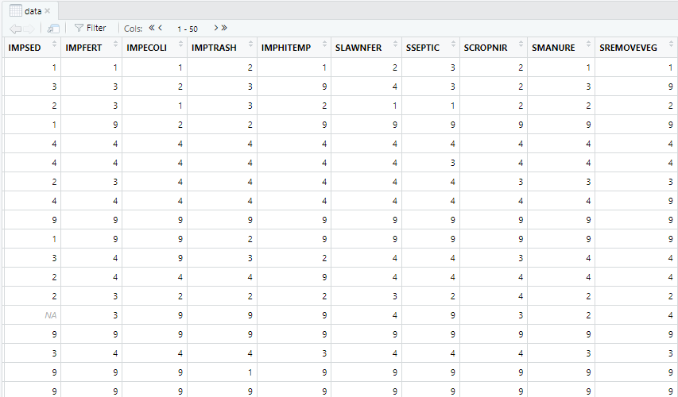
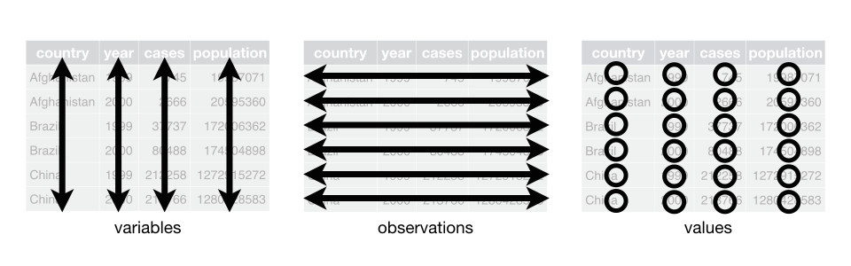
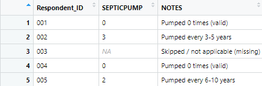
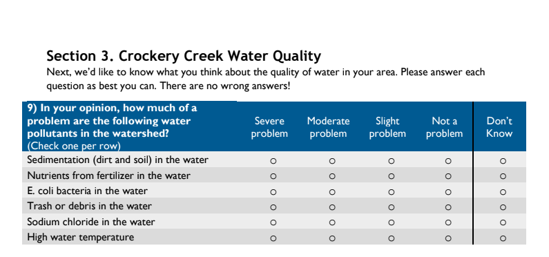
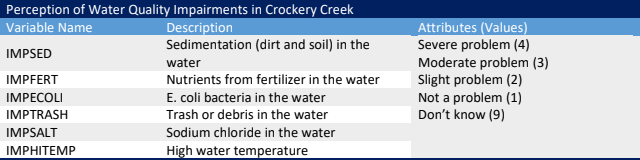
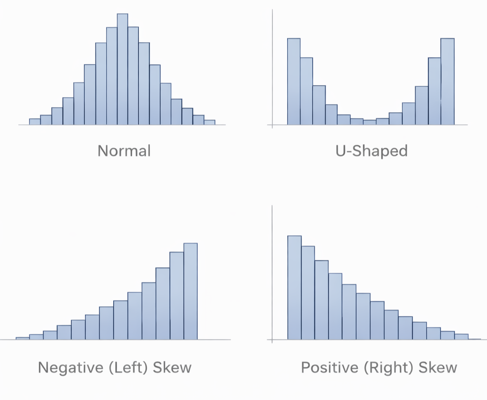

**Learning Objectives**

-   Use RStudio to organize raw data into frequency distributions
-   Interpret data documentation to understand what survey variables and values represent
-   Describe the shape of a variable's distribution
-   Explain how frequency distributions support interpretation of survey responses

------------------------------------------------------------------------

I was a horrible statistics student. I approached the subject with a survivor mentality, clawing my way through assignments and exams and immediately forgetting all related content due to immense anxiety. I took my B in graduate social statistics (failing in graduate terms) and gladly moved on to complete a qualitative dissertation.

Imagine my surprise when I landed my first job and was immediately asked to lead projects requiring survey research. I did what any young graduate with a mountain of student loan debt does – jumped right in!

When I first encountered John Kranzler’s (2017) book, *Statistics for the Terrified*, I felt seen. Kranzler had a way of describing my statistics paralysis in hilarious prose and breaking down basic terminology in a way I found accessible – and even fun. My own take on this topic therefore follows his excellent model.

If you are feeling stressed about talking about statistics, I invite you to take a moment to watch the short video, *What is Statistics Anxiety*?

<iframe width="560" height="315" src="https://www.youtube.com/embed/iymgY56mgCo?si=YEXNRE8owu9FxmhZ" title="YouTube video player" frameborder="0" allow="accelerometer; autoplay; clipboard-write; encrypted-media; gyroscope; picture-in-picture; web-share" referrerpolicy="strict-origin-when-cross-origin" allowfullscreen>

</iframe>

Stats anxiety is problematic because it blocks us from learning, prevents us from asking questions, and generally snowballs into an unproductive physical and mental state. Instead of focusing on your performance goals and the fear that you won’t reach them, try focusing on the learning process as we move forward, and acknowledge how struggling with new material can contribute to your academic and professional growth.

We will ease into our data explorations by reviewing the structure of data in raw form and tracing the process of transitioning data from unordered numbers to interpretable distributions. This introduction will have relevance beyond your West MI Watersheds analysis, laying a foundation of data literacy you will build on throughout your professional life.

## Data Structure

Let’s begin our journey into data analytics by clarifying two important terms: data and statistics.

In quantitative research, <abbr title="A collection of information."
      style="font-weight: bold; text-decoration: underline dotted; cursor: help;"> <em>data</em> </abbr> are pieces of information represented as numbers. These numbers may describe things like behaviors, experiences, opinions, or characteristics of people. This contrasts with qualitative data, which are expressed as text, images, or other non-numeric forms (Sheppard, 2020).

<abbr title="Techniques and procedures for working with quantitative data."
      style="font-weight: bold; text-decoration: underline dotted; cursor: help;"> <em>Statistics</em> </abbr> refers to the set of tools we use to organize, summarize, and display quantitative data in ways that make patterns easier to see and interpret (Kranzler, 2017). We’ll begin with the most basic statistical task of all: turning <abbr title="Data in its original, unorganized form before it has been summarized or cleaned."
      style="font-weight: bold; text-decoration: underline dotted; cursor: help;"> <em>raw data</em> </abbr> into something we can understand.

Before we can describe or analyze data, we need to understand what we are actually looking at when we open a dataset in RStudio. At first glance, a data file looks like a large grid of numbers that doesn’t mean very much at all.



In reality, data files follow a conventional and meaningful structure:

-   Each row represents a case. In survey data, each row corresponds to one survey participant.
-   Each column represents a variable, or a characteristic measured by the survey (such as age, frequency of septic tank pumping, or perceptions of water quality).
-   Each cell contains a value, which is the recorded response for one person on one variable.

{fig-alt="A graphic of a data file showing variables in columns, observations in rows, and values in cells."}

Understanding this structure helps you keep track of which information lives where in your dataset. If you are interested in how people answered a particular survey question, you will look down a column. If you want to understand one participant’s full set of responses, you will look across a row.

However, simply seeing numbers in a dataset does not mean those numbers can be analyzed immediately. Raw data often include values that serve special purposes, such as indicating a skipped question, a “don’t know” response, or a response that does not apply to a particular person (Arthur & Clark, 2021). These values are part of the dataset’s structure, but they require interpretation before analysis.

Another critical concept to understand is the difference between a <abbr title="Data entries indicating that no valid response is available; coded as NA in R."style="font-weight: bold; text-decoration: underline dotted; cursor: help;"> <em>missing value</em> </abbr> and a value of zero (Zimmer et al., 2024).

{fig-alt="A sample dataset showing cells containing missing values (NA) and zero values (0)." fig-align="center"}

In RStudio, missing data are represented as `NA`, which stands for “not available.” An `NA` means that no valid response was recorded for that cell. That might occur because a respondent skipped a question, was not eligible to answer it, or recorded a response that was invalid (such as selecting two answers to the same question or penciling in a response off the given answer scale).

A value of `0`, by contrast, is not missing. A zero is a recorded value that has meaning defined in the data documentation. For example, a value of `0` might indicate that a respondent did not engage in a particular activity, used a practice zero times, or selected a specific response option that was coded `0`.

This distinction matters because R treats `NA` and `0` very differently. Missing values are excluded from most calculations by default, while zero values are included. If you accidentally treat a zero as missing, or a missing value as a zero, you can seriously distort your results.

For these reason, one of your first responsibilities when working with a dataset is to use the codebook to determine which values represent real responses and which represent missing or non-applicable information. Only then can you begin summarizing your data with confidence.

## Data Documentation

Once you understand the basic structure of a dataset – rows as people, columns as variables, and cells as values – the next step is learning how to interpret what those values actually mean. This is where <abbr title="The collection of materials, such as codebooks, questionnaires, and technical notes, that describe how data were collected, coded, and structured."style="font-weight: bold; text-decoration: underline dotted; cursor: help;"> <em>data documentation</em> </abbr>, and especially the codebook, becomes essential.

Without documentation a dataset is just a jumble of numbers. With documentation, those numbers become meaningful information about people, behaviors, and perceptions.

A <abbr title="A document that explains how survey responses were recorded and stored in a dataset."style="font-weight: bold; text-decoration: underline dotted; cursor: help;"> <em>codebook</em> </abbr> (sometimes called a data dictionary) serves as the translation key between human language and machine-readable data (Arthur & Clark, 2021).

At minimum, a codebook typically tells you:

-   The variable name used in the dataset
-   A description of what the variable measures (the survey question)
-   The <abbr title="Descriptions that explain what specific numeric values represent (e.g., 1 = “Never,” 3 = “Every 3–5 years”)."style="font-weight: bold; text-decoration: underline dotted; cursor: help;"> <em>value label</em> </abbr> assigned to each response option
-   Any special codes used for “don’t know” or inapplicable responses (Zimmer et al., 2024).

For example, a survey question asking about the frequency of septic tank pumping may be stored as a variable named SEPTICPUMP, with values coded as:

-   0 = Never
-   1 = More than 10 years
-   2 = Every 6-10 years
-   3 = Every 3-5 years
-   998 = I don’t have a septic system

Looking only at the dataset, you would see numbers like `0, 1, 2, 3, 998`. The codebook tells you how to interpret those numbers correctly.

It may be tempting to jump straight into calculating averages, creating graphs, or running models as soon as you load your data in R. However, doing so without consulting the codebook can lead to serious errors (Sheppard, 2020). Because of this, you should always examine the codebook before summarizing a variable and be familiar with the items as they were presented to respondents in the <abbr title="The survey instrument presented to respondents."style="font-weight: bold; text-decoration: underline dotted; cursor: help;"> <em>questionnaire</em> </abbr>, or survey instrument, itself (Zimmer et al., 2024).



{fig-alt="A question block taken from a questionnaire and its companion documentation in the associated codebook."}

Most surveys include responses that are not part of an ordered scale, such as “don’t know” or “not applicable.” These responses are often assigned <abbr title="A numeric code used to represent responses like “don’t know” or “not applicable” that fall outside the substantive response scale."style="font-weight: bold; text-decoration: underline dotted; cursor: help;"> <em>out-of-range values</em> </abbr> (such as 9, 99, or 998) so that they are not confused with substantive responses (Arther & Clark, 2021; Zimmer et al., 2024). These numeric codes may need to be converted to missing data (NA) before calculating means or medians, or they will distort the reported values. Considering our perceptions of water quality variables, above, if I calculated an average for these items without reassigning out-of-range values to missing data, I might end up with an average score of 6 on an item whose substantive range is 1-4. Oops!

Beyond interpreting values, codebooks also guide common <abbr title="The process of preparing data for analysis, including cleaning, recoding, transforming variables, and handling missing or special values."style="font-weight: bold; text-decoration: underline dotted; cursor: help;"> <em>data management</em> </abbr> tasks, such as deciding when to create <abbr title="A binary variable coded as 0 or 1 to indicate the absence or presence of a specific characteristic or response."style="font-weight: bold; text-decoration: underline dotted; cursor: help;"> <em>dummy variables</em> </abbr>, identifying variables that need <abbr title="A data management technique that flips the direction of a scale so higher values consistently represent the same underlying concept."style="font-weight: bold; text-decoration: underline dotted; cursor: help;"> <em>reverse coding</em> </abbr>, understanding how multi-item concepts are measured, and determining which variables are comparable across survey locations. These transformations are a routine part of quantitative data preparation (Arthur & Clark, 2021).

Using documentation may feel tedious or confusing at first, but it is one of the most important habits you will develop as a data analyst. Careful attention to codebooks prevents misinterpretation, supports transparency, and ensures that your findings are defensible. Before moving on to describing distributions or calculating statistics, make it routine to ask:

-   What does this variable measure?
-   What do the values represent?
-   Are any responses coded in a special way?
-   Do I need to clean or recode this variable before summarizing it?

## Your RStudio Workspace

Before we dig into our data, we need to take a moment to review where the analysis happens. In this course, all lab work takes place in Posit Workbench, using the RStudio interface. RStudio is a quantitative data analysis program that has quickly gained popularity because it is open source, meaning that it is free to use. Many other programs can perform similar tasks, but most require expensive licensing fees and are therefore less accessible.

Operating in RStudio requires careful attention to file organization. Unlike tools such as Google Docs, where files are saved automatically and location is mostly invisible, RStudio works with files that live in specific folders. Understanding where your files are stored, and where R looks for them, is essential for running code successfully.

An <abbr title="A self-contained workspace that organizes all files for a single analysis and automatically sets the project folder as the working directory."style="font-weight: bold; text-decoration: underline dotted; cursor: help;"> <em>RStudio Project</em> </abbr> is a self-contained workspace that holds everything related to a single analysis, including data files, coding scripts, figures, and outputs. Each project is a folder that exists on a remote server, not on your personal computer and not in Google Drive. When a project is open, that folder becomes your <abbr title="The folder R uses as its reference point for reading and saving files."style="font-weight: bold; text-decoration: underline dotted; cursor: help;"> <em>working directory</em> </abbr>, or home base for analysis.

This setup ensures that file paths behave predictably and that files can be easily located and read into your code. Think of a your project folder as a well-organized binder: if the data are not in the binder, R cannot read them - no matter how good your code is.

When you open an RStudio project in Posit Workbench, your screen is divided into four panes.

-   **Source (upper left)** is where you write and edit scripts and R Markdown files.
-   **Console (lower left)** shows code as it runs and displays messages or errors.
-   **Environment (upper right)** lists data objects you have loaded or created.
-   **Output (lower right)** is where you navigate folders, view plots, and access documentation.

{fig-alt="Diagram showing the Source pane upper left, Console pane lower left, Environments pane upper right, and Output pane lower right of the RStudio interface."}

A useful habit to develop early is to notice *where output appears*. Tables may print to the Console, plots appear in the Plots tab, and loaded datasets show up in the Environment pane. When something does not appear where you expect, the panes provide important clues about what happened.

Because file location matters so much, it's important to know how to confirm that you are working in the correct project. You can check this in three quick ways:

1.  **Check the Files pane (lower right).** You should see the contents of your poject folder listed there (data files, Markdown files, and folders).
2.  **Look at the project name in the upper-right corner of RStudio.** This tells you which project is currently active.
3.  **Notice the working directory shown in the Console.** When a project is open, R automatically points to that project folder as the working directory.

If your Files pane looks empty, unfamiliar, or contains the wrong files, you are likely not in the correct project. Opening the correct project usually resolves file-related errors immediately, without changing any code.

All instructions provided in this book and lab assignments assume you are working inside a project folder. When we load data using a command like `data<-read_csv("demo_data.csv")`, R looks for the file `demo_data.csv` *inside the current project folder*. This is known as using a <abbr title="A file location specified in relation to the current working directory rather than a full computer-specific address."style="font-weight: bold; text-decoration: underline dotted; cursor: help;"> <em>relative file path</em> </abbr>. In contrast, absolute paths (such as `C:/Users/...`) tend to break when code is shared or reopened later. By organizing your work inside a project folder and using relative paths, you reduce the risk of file errors and spend less time crying over error messages that say "file does not exist."

Any time you are about to run code that loads data, save yourself some frustration and check:

-   Am I inside the correct project?
-   Is the data file located in this project folder?
-   Does the filename in my code exactly match the filename I see in the Files pane?

Once your project is open and your files are in place, you are ready to get down to business: organizing raw survey responses into frequency distributions.

## Frequency Distributions

When we begin any data exploration, the first thing we want to do is inspect the distribution of responses on each item in our analysis. This gives us an understanding of how people responded to each survey question and whether or not an individual item is a good candidate for use in more advanced analyses.

**Loading the data**

```{r load-packages, message=FALSE, warning=FALSE}
library(tidyverse)
data <- read_csv("demo_data.csv")
```

**Creating a frequency distribution with `count()`**

As we already saw, raw data appear as unordered sets of values that don't tell us very much. A frequency distribution organizes data by summarizing how often a specific score was obtained (Kranzler, 2017).

One of the simplest ways to create a frequency distribution in R is with the `count()` function.

```{r}
data %>% 
  count(SEPTICPUMP)
```

This output shows:

-   A row index, added for readability and not part of the data,
-   Each response category, `0-3` for the variable `SEPTICPUMP` in the second column, and
-   The number of respondents `n` who selected each category.

We can now begin to see patterns that were not apparent in the raw data: which responses were most common, which were rare, and whether responses tended to cluster around particular values.

Frequency distributions are also the foundation for graphical displays, such as bar charts and histograms, which make the shape of the distribution easier to see and interpret (Agresti, 2018).

```{r message=FALSE, warning=FALSE}
data %>% 
  ggplot(aes(x = SEPTICPUMP)) +
  geom_bar() +
  labs(
    x = "Frequency of septic tank pumping",
    y = "Number of respondents"
  )
```

This bar chart presents the same information as the frequency table, but in visual form. Each bar represents the number of respondents who selected a particular response category for septic tank pumping frequency. I can now easily see that responses cluster around category `3`, which corresponds to pumping the tank every 3-5 years.

There are several common distribution shapes that we will look for as we scan our data:

{fig-alt="Four curves demonstrating normal, U-shaped, right-skew, and left-skew distributions."}

-   **Bell-shaped (normal) distributions**, where most values fall near a central point and the distribution is symmetrical.
-   **U-shaped distributions**, where responses cluster at the lowest and highest possible values, indicating polarization.
-   **Skewed distributions**, where responses cluster toward one end of the scale, producing a long tail on the opposite end.

Further, a distribution may be:

-   **Negative (left) skewed**, with most values at the high end and a longer tail on the left, or
-   **Positive (right) skewed**, with most values at the low end and a longer tail on the right.

The shape of a distribution affects what we can reasonably do with the data next. Variables that follow a roughly normal distribution are especially analytically rich: summary statistics like the mean and standard deviation provide meaningful descriptions of a “typical” case, and many statistical techniques assume normality.

Highly skewed distributions, by contrast, can limit which analyses are appropriate and how results should be interpreted. That said, all distributions tell us something meaningful about people’s responses. At this stage, the goal is not to explain *why* a particular pattern exists, but to simply recognize the overall structure of responses and identify any data management actions that need to be handled before moving on.

## Summary

This chapter focused on the transition from raw data to meaningful statistical insight. Rather than rushing into calculations, we emphasized the importance of slowing down to understand how data are structured, documented, and interpreted before analysis begins. We also introduced the importance of working within a well-organized analysis environment, since careful file organization and project setup shape everything that follows.

We explored how organizing data into frequency distributions transforms unordered values into interpretable patterns. Looking at how responses are distributed allows us to see where answers cluster, how much they vary, and whether a variable is likely to support more advanced analysis. Just as importantly, we highlighted that not all data are immediately ready for analysis. Values may require interpretation, cleaning, or recoding before they can be summarized responsibly.

Together, these steps establish a foundation for descriptive statistics: understanding what the data represent, how responses are distributed, and why those patterns matter. Moving forward, we’ll build on this foundation by introducing levels of measurement and work on formally describing the center and spread of distributions. Keep calm and statistics on!

## Reflection Questions

1.  **Survey datasets often include values that represent different kinds of information, such as substantive responses, missing data, or special codes like “don’t know.”** How might misunderstanding these distinctions affect the conclusions a researcher draws from a dataset?

2.  **Frequency distributions are often the first step in quantitative analysis.** How does examining the distribution of responses help researchers assess whether a survey question meaningfully captures variation in people’s experiences or opinions?

3.  **The shape of a distribution can reveal clustering, polarization, or imbalance in responses.** Why is understanding these patterns important before applying more advanced statistical techniques?

4.  **Early decisions about how data are organized, cleaned, and analyzed shape everything that follows.** How might careless early steps limit the usefulness or credibility of later findings?

## References

::: references
-   Agresti, A. (2018). Statistical Methods for the Social Sciences (5th ed.). Pearson Education.

-   Arthur, M. M. L., & Clark, R. (2021). Social Data Analysis: Qualitative and Quantitative Approaches. Open Educational Resource.<https://pressbooks.ric.edu/socialdataanalysis/>.

-   Çetinkaya-Rundel, M. and Hardin, J. (2024). Introduction to Modern Statistics, 2e. OpenIntro. CC-SA 3.0 <https://openintro-ims.netlify.app/>.

-   Kranzler, J.H. (2017). Statistics for the Terrified (6th ed.). Roman & Littlefield.

-   Sheppard, V. (2020). Research Methods for the Social Sciences: An Introduction. Pressbooks. CC-BY-NC-SA 4.0. <https://pressbooks.bccampus.ca/jibcresearchmethods/>.

-   Zimmer, S. A., Powell, R. J., & Velásquez, I. C. (2024). Exploring Complex Survey Data Analysis Using R: A Tidy Introduction with {srvyr} and {survey}. Chapman & Hall: CRC Press. <https://tidy-survey-r.github.io/tidy-survey-book/>.
:::
