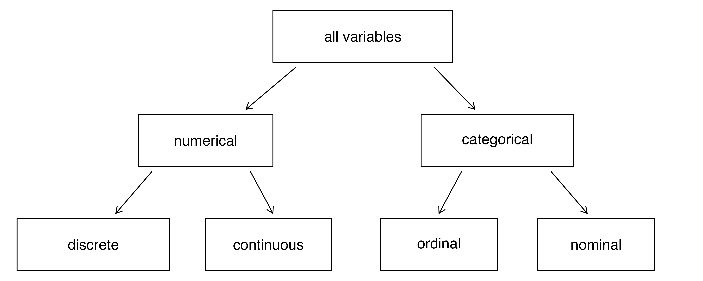

**Learning Objectives**

-   Understand the levels of measurement in your analysis
-   Describe the shape, center, and variation of a variable
-   Organize and visualize categorical proportions
-   Examine the spread of numeric data

------------------------------------------------------------------------

After we've given the variables in our analysis an initial inspection, verified that the values on variables in our data match those recorded in the codebook, and handled any necessary data management tasks (like recoding out-of-range values to missing), we're ready to take a deeper look at distributions in our analysis.

<abbr title="Analytic techniques applied to one variable at a time to provide numeric summaries about the data."style="font-weight: bold; text-decoration: underline dotted; cursor: help;"> <em>Descriptive statistics</em> </abbr> are used in this exploratory stage of analysis, where we're still getting familiar with the characteristics of participants in our survey data and their responses to survey items relevant to our research questions (Gomes, 2021). Our goal at this stage is to create more organized tables and graphics that describe and summarize characteristics of variables in our data.

At this point, we also need to be mindful of the structure of the variables themselves. Characteristics of the variables determine which statistical techniques are appropriate for summarizing the center and spread of distributions, and which visualizations are appropriate for graphically displaying each item. Therefore, we'll start by reviewing scales of measurement in our data before moving on to describe each variable's center and spread.

Throughout this chapter, pay attention to the number of observations ( *n* ) underlying any percentages or summary statistics you see. Keep in mind that a pattern based on five responses does not carry the same analytic weight as one based on fifty or more.

## Levels of Measurement

There are several distinctive types of variables based on their measurement characteristics, as summarized in the figure below.

{fig-alt="A graphic illustrating distinctions between variable types."}

<abbr title="Variables that can take a wide range of numerical values which can be used for mathematical computations (i.e., add, subtract, or take averages)."style="font-weight: bold; text-decoration: underline dotted; cursor: help;"> <em>Numerical variables</em> </abbr> are measures that can be treated as integers. It makes sense to add, subtract, or average values like number of acres of farmland, or miles driven to a favorite fishing spot. In contrast, a variable measuring the type of property someone owns may still be assigned a number in our dataset, (i.e., farm = 1, rural residence = 2, in-town residence = 3), but it doesn't make sense to subtract 1 from 2 in this example because this is a <abbr title="Variables with categories that, while assigned numbers, can not be used to make meaningful mathematical computations."style="font-weight: bold; text-decoration: underline dotted; cursor: help;"> <em>categorical variable</em> </abbr> that doesn't have a clear numeric meaning.

Numerical variables may be <abbr title="Numerical variables that can take on certain numbers with jumps, as in whole numbers."style="font-weight: bold; text-decoration: underline dotted; cursor: help;"> <em>discrete,</em> </abbr> meaning they can only assume certain values. For example, the number of classes you are currently enrolled in is a discrete variable that can only be a whole number - you may be taking one, two, three, or four classes, but you can’t be taking 1.5 classes. In contrast, <abbr title="Numerical variables that can take on any value, including fractions of a whole number."style="font-weight: bold; text-decoration: underline dotted; cursor: help;"> <em>continuous variables</em> </abbr> can be any value. For example, height and weight can be fractions of a whole number.

Categorical variables may have a natural ordering, like a variable measuring education level whose attributes range from *less than a high school diploma* to *graduate degree.* This is an <abbr title="A variable that ranks people or objects on an ordered scale with the units of measurement being mathematically unequal between categories."style="font-weight: bold; text-decoration: underline dotted; cursor: help;"> <em>ordinal variable</em> </abbr> because characteristics are ranked according to magnitude on a continuum. However, while the values are on an ordered scale, the units of measurement are not equal values apart (which is how you know that it is a categorical variable rather than a numerical variable). In contrast, <abbr title="Variables that assign people to categories that have a distinct numeric value, but the number assigned to each category is arbitrary."style="font-weight: bold; text-decoration: underline dotted; cursor: help;"> <em>nominal variables</em> </abbr> assign people to categories that have a distinct numeric value, but the number assigned to each category is arbitrary. African American respondents are coded "1", Asian respondents are coded "2", and Hispanic respondents are coded "3," for no particular reason.

Now that we know something about the types of variables in our data, we can apply descriptive statistical techniques to summarize their distributions.

## Measures of Central Tendency

Often we are interested in finding a single number that tells us something about the typical score in a distribution. <abbr title="A single number that tells us something about a typical score in a distribution."style="font-weight: bold; text-decoration: underline dotted; cursor: help;"> <em>Measures of central tendency</em> </abbr> help us find the center of our data, and examine variance around the center.

Most commonly, the arithmetic <abbr title="The sum of all values divided by the number of observations."style="font-weight: bold; text-decoration: underline dotted; cursor: help;"> <em>mean</em> </abbr> (often called the *average*), is used to describe the center of a frequency distribution. A mean is calculated by dividing the sum of the observations by the number of observations (Kranzler, 2017).

This is represented by the equation:

$$
\bar{x} = \frac{\sum x}{n}
$$

where:

-   $\bar{x}$ is the mean,
-   $\sum x$ is the sum of all observed values, and
-   $n$ is the number of observations in the sample.

Another way to describe the center of a distribution is the <abbr title="The middle value when observations are ordered from least to greatest."style="font-weight: bold; text-decoration: underline dotted; cursor: help;"> <em>median,</em> </abbr> which is the score that falls exactly in the middle of the distribution when all scores are listed in order, least to greatest. The median divides the distribution into two equal halves.

**Step 1:** Start with the raw (unordered) values

8  2  12  6  10  4  14

**Step 2:** Order the values from least to greatest

2  4  6  **8**  10  12  14

The median is the middle value (8).

If there are an even number of cases, there will be two numbers at the midpoint of the ordered distribution. In this case, the median is calculated by finding the mean of the two middle values.

**Ordered values:**

2  4  **6  8**  10  12

The median is the average of the two middle values: (6 + 8) / 2 = 7.

Finally, the <abbr title="The most frequently occurring value."style="font-weight: bold; text-decoration: underline dotted; cursor: help;"> <em>mode</em> </abbr> is the score that occurs most frequently in the distribution. It is an indicator of the most common outcome on a particular variable.

Let's return to my septic tank pumping frequency example for just a minute.

```{r load-packages, message=FALSE, warning=FALSE}
library(tidyverse)

data <- read_csv("demo_data.csv")

data %>% 
  count(SEPTICPUMP)
```

The mode of this distribution is the value that occurs most frequently. In this case, the modal response is `3`, with *n* = 181 observations.

According to the codebook, a value of `3` corresponds to a septic tank pumping frequency of *every 3–5 years*. This means that the most common pumping practice reported by respondents is pumping their septic tank every 3–5 years.

How, then, do you decide which measure of central tendency to report? So glad you asked. Before choosing how to summarize a variable, we need to consider what kind of information that variable contains.

Some variables represent quantities that can be meaningfully added, averaged, or compared using arithmetic. For example, quiz scores, age, or number of acres farmed are numeric values, and it makes sense to calculate an average for them.

```{r message=FALSE, warning=FALSE}
data %>%
  summarise(
    mean_acres = mean(SIZE, na.rm = TRUE)
  )
```

Because `SIZE` represents the number of acres farmed, the mean can provide a meaningful summary of the center of this distribution. The summary statistics above tell me that the average farm size in this dataset is 76.2 acres.

However, when a numeric variable is highly skewed, the mean can be pulled toward extreme values. It may therefore be helpful to compare the mean and median.

```{r message=FALSE, warning=FALSE}
data %>%
  summarise(
    mean_acres = mean(SIZE, na.rm = TRUE),
    median_acres = median(SIZE, na.rm = TRUE)
  )
```

In this example, the mean is much larger than the median, indicating a right-skewed distribution. A small number of large farms pull the mean upward, while the median reflects the typical farm size more accurately.

Other variables use numbers simply as category labels rather than true quantities. Some of these categorical variables have a natural order, such as responses that range from “strongly disagree” to “strongly agree,” while others have no meaningful ranking – such as race, neighborhood, or property type. Whether a variable represents a quantity, an ordered set of responses, or an unordered set of labels determines how it should be summarized.

The variable `TYPE` represents the type of property a landowner owns and is coded `1 = residential`, `2 = small farm`, and `3 = large farm`. These categories are coded numerically but the values function as mere labels, not quantities, and they have no logical order. For variables consisting of unordered categories like this, the most appropriate measure of center is the mode, which identifies the most common response.

```{r message=FALSE, warning=FALSE}
data %>%
  filter(!is.na(TYPE)) %>%
  count(TYPE) %>%
  arrange(desc(n))
```

In this case, the modal category is `1`, corresponding to residential properties, indicating that this is the most common property type reported by respondents. Because `TYPE` is a nominal variable, the mean or median would not provide a meaningful summary of the center.

In sum, here are a few rules of thumb to follow when deciding which measure of central tendency to report:

-   If the variable represents a numeric quantity (where averaging makes sense), report the mean value.
-   If the distribution of a numeric quantity is highly skewed, report the median value instead.
-   If the variable consists of ordered response options, report the median value.
-   If the variable consists of unordered labels, report the most common response (the mode).

## Assessing Variation in Responses

Along with being able to describe a typical value, we need to know something about the <abbr title="The dispersion, or spread, of scores around the central value in a distribution."style="font-weight: bold; text-decoration: underline dotted; cursor: help;"> <em>variation</em> </abbr> of the distribution, or the spread of scores around that typical value.

Box plots are helpful for visualizing both the center and spread of numeric variables, such as the variable `TIMERES` representing the number of years a respondent has lived in the watershed.

```{r message=FALSE, warning=FALSE}
ggplot(data, aes(y = TIMERES)) +
  geom_boxplot(fill = "lightgray") +
  labs(
    title = "Length of Residence in Watershed",
    y = "Years"
  ) +
  theme_minimal()
```

A boxplot summarizes the distribution by showing its center, spread, and potential outliers.

-   The line inside the box represents the median, indicating that a typical respondent has lived in the watershed for about 25 years.
-   The bottom and top of the box mark the first and third quartiles, showing that the middle 50% of respondents have lived in the watershed for roughly 10 to 40 years.
-   The “whiskers” extend to values near the minimum and maximum, illustrating the overall spread of the distribution - from new arrivals to someone who has lived in the watershed for more than 80 years.
-   Points beyond the whiskers (if present) represent unusually high or low values.

The height of the box and the length of the whiskers give a visual sense of variation: taller boxes and longer whiskers indicate greater spread in the data.

In addition to this visual summary, we often want numeric measures that describe variation more precisely.

A simple way to describe variation is the <abbr title="The distance between the minimum and maximum values in a dataset."style="font-weight: bold; text-decoration: underline dotted; cursor: help;"> <em>range,</em> </abbr> which refers to the difference between the greatest and smallest values in the distribution.

Another important measure of variability is the <abbr title="Describes the typical distance between individual values and the mean."style="font-weight: bold; text-decoration: underline dotted; cursor: help;"> <em>standard deviation,</em> </abbr> which is a measure of how far a value in a set of scores deviates from the mean.

```{r message=FALSE, warning=FALSE}
data %>%
  summarise(
    n     = sum(!is.na(TIMERES)),
    min   = min(TIMERES, na.rm = TRUE),
    max   = max(TIMERES, na.rm = TRUE),
    range = max(TIMERES, na.rm = TRUE) - min(TIMERES, na.rm = TRUE),
    sd    = sd(TIMERES, na.rm = TRUE)
  ) %>%
  knitr::kable(
    col.names = c("N", "Minimum", "Maximum", "Range", "Standard Deviation"),
    caption = "Summary Statistics for Length of Residence in the Watershed"
  )
```

These statistics quantify what the boxplot shows visually - the range captures the full spread of the data (the difference between the minimum and maximum values), while the standard deviartion summarizes the typical spread around the mean.

If the frequency distribution is bell-shaped:

-   Approximately 68% of scores will fall within one standard deviation (positive or negative) of the mean.
-   Approximately 95% of scores will fall within two standard deviations of the mean.
-   Nearly all scores (99.7%) will fall within three standard deviations of the mean.

The important thing to remember about standard deviations is what they tell us about the shape of the distribution. If the data are clustered around the mean, the standard deviation will be lower, resulting in a curve that is tall and narrow. If the data are dispersed, or spread out, the standard deviation will be higher, producing a curve that is short and wide.

## Categorical Distributions

For categorical variables, describing variation in the same way we do for numeric data is not meaningful. Instead, our goal is to understand how responses are distributed across categories.

While the `count()` function is useful for an initial scan of our data - allowing us to quickly see how many responses fall into each category - examining the proportion of responses provides a clearer picture of the relative contribution of each category to the whole. To improve readability, response codes are converted from integers to labeled factors so that category names, rather than numeric codes, appear in the output.

```{r message=FALSE, warning=FALSE}
data %>%
  mutate(
    SEPTICPUMP = factor(
      SEPTICPUMP,
      levels = c(0, 1, 2, 3),
      labels = c(
        "Never", "More than 10 years", "6–10 years", "3–5 years")
    )
  ) %>%
  filter(!is.na(SEPTICPUMP)) %>%
  count(SEPTICPUMP) %>%
  mutate(percent = round(100 * n / sum(n), 1)) %>%
  bind_rows(
    summarise(
      .,
      SEPTICPUMP = "Total",
      n = sum(n),
      percent = 100
    )
  ) %>%
  knitr::kable(
    col.names = c("Septic Tank Pumping Frequency", "Count", "Percent"),
    caption = "Distribution of Septic Tank Pumping Frequency"
  )
```

In the output, you can see:

-   Each response category for the variable, listed in the first column.
-   The count of respondents who selected each category.
-   The percent of valid responses each category represents (missing values excluded).
-   A total row summarizing the total number of valid responses and confirming that percentages sum to 100%.

In my `SEPTICPUMP` example, 58.6% (*n* = 181) of respondents reported pumping their septic tank every 3-5 years, making this by far the most common maintenance interval. About 23.3% (*n* = 72) reported pumping every 6-10 years, while 10.7% (*n* = 33) haven't had their tank pumped in over 10 years. Only 7.4% of respondents (*n* = 23) said they have never had their tank pumped. An additional 14 respondents (about 4% of the full sample) did not report a pumping frequency.

Rather than describing septic tank pumping for the entire sample, we may be interested in examining how this practice varies across different types of properties. A 100% stacked bar chart allows us to compare the proportion of responses within each group, making differences across categories easier to see.

```{r message=FALSE, warning=FALSE}
data %>% 
  filter(!is.na(SEPTICPUMP), !is.na(TYPE)) %>% 
  mutate(
    SEPTICPUMP = factor(SEPTICPUMP,
      levels = c(0, 1, 2, 3),
      labels = c("Never", "More than 10 years", "6–10 years", "3–5 years")),
    TYPE = factor(TYPE,
      levels = c(1, 2, 3),
      labels = c("Residential", "Small farm", "Large farm"))) %>% 
  ggplot(aes(x = TYPE, fill = SEPTICPUMP)) +
  geom_bar(position = "fill", color = "white") +
  scale_fill_grey(start = 0.85, end = 0.25) +
  scale_y_continuous(labels = scales::percent_format()) +
  labs(
    x = "Property type",
    y = "Percent of respondents",
    fill = "Septic tank pumping frequency"
  ) +
  theme_minimal()
```

In the plot above, I can see that residential property owners were slightly more likely to report pumping their septic tank at the recommended 3-5-year interval compared to farm property owners.Large farms were more likely to report that their last pump-out was more than 10 years ago than were small farms, but they were also slightly less likely to report that they have never pumped their septic tank than both residential and small farm owners.

While it is informative to assess these distributions visually, this plot also raises new questions. Are such apparently slight differences in practice among property owners really meaningful? At what point are these differences great enough to merit making specific management or outreach recommendations to distinct groups? These are the questions we'll turn to next as we tackle hypothesis testing and statistical significance.

## Summary

Describing survey data is a foundational step in any research or analytic workflow. Before testing hypotheses or making comparisons across groups, we must first understand what our data look like: how values are distributed, where typical responses fall, and how much variation exists across observations. Descriptive statistics and visualizations provide the tools needed to develop this familiarity with the data.

This chapter emphasized the importance of aligning analytic choices with the structure of the variables in an analysis. Decisions about whether to report a mean, median, or mode, and how to visualize a distribution, depend on whether a variable represents a true quantity, an ordered set of responses, or unordered categories. Understanding these distinctions helps ensure that summaries are meaningful and interpretable.

Importantly, descriptive analysis does more than summarize data; it generates new questions. Patterns observed in tables and graphs may point to unexpected features or group differences that merit closer attention. At this stage, it often makes sense to pause, take inventory, and refine research questions as needed to integrate new observations and insights before moving on to more advanced analyses.

## Reflection Questions

1.  **Researchers must choose summary statistics that align with how a variable is measured.** What problems can arise if a mean is reported for a variable that represents unordered categories rather than numeric quantities?

2.  **Two datasets can have the same average but very different distributions.** Why is it important to examine measures of variation and visualizations in addition to measures of central tendency?

3.  **Categorical tables often report both counts and percentages.** In what situations might percentages be misleading if the underlying number of observations is small?

4.  **Visualizations are used in this chapter to summarize how responses are distributed across values or categories.** What information did you learn from a graph that was harder to see in a table, or vice versa?

5.  **Descriptive analysis often raises new questions rather than providing final answers.** How can patterns observed at this stage help researchers refine, narrow, or clarify their research questions?

## References

::: references
-   Arthur, M. M. L., & Clark, R. (2021). Social Data Analysis: Qualitative and Quantitative Approaches. Open Educational Resource.<https://pressbooks.ric.edu/socialdataanalysis/>.
-   Çetinkaya-Rundel, M. and Hardin, J. (2024). Introduction to Modern Statistics, 2e. OpenIntro. CC-SA 3.0 <https://openintro-ims.netlify.app/>.
-   Dillman, D. A., Smyth, J. D., & Christian, L. M. (2014). Internet, Phone, Mail, and Mixed-Mode Surveys: The Tailored Design Method (4th ed.). John Wiley & Sons.
-   Gomes, G.G. (2021). Descriptive statistics: Expectations vs. reality (exploratory data analysis - EDA). Towards Data Science. <https://towardsdatascience.com/descriptive-statistics-expectations-vs-reality-exploratory-data-analysis-eda-8336b1d0c60b/>.
-   Kranzler, J.H. (2017). Statistics for the Terrified (6th ed.). Roman & Littlefield.
-   Saylor Academy. (2012). Principles of Sociological Inquiry: Qualitative and Quantitative Methods. CC-BY-NC-SA 4.0 <https://saylordotorg.github.io/text_principles-of-sociological-inquiry-qualitative-and-quantitative-methods/index.html>.
-   Sheppard, V. (2020). Research Methods for the Social Sciences: An Introduction. Pressbooks. CC-BY-NC-SA 4.0. <https://pressbooks.bccampus.ca/jibcresearchmethods/>.
:::
