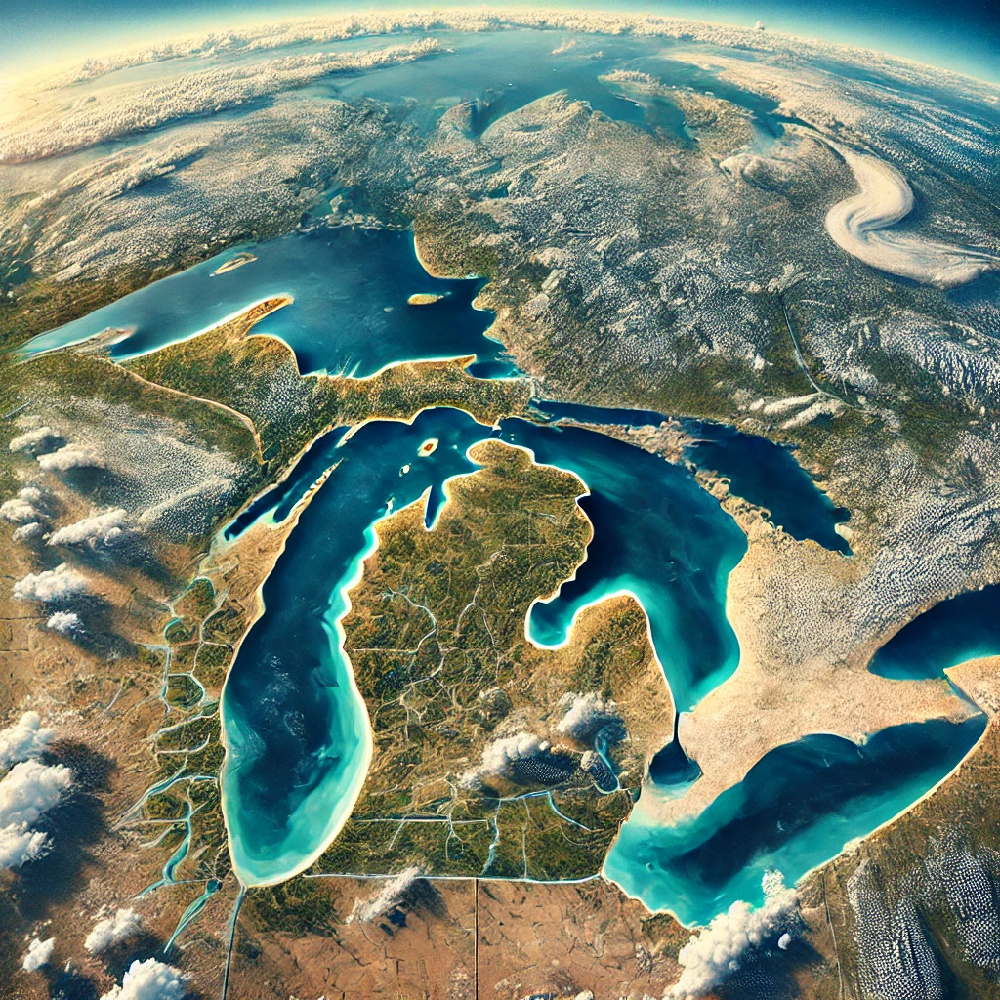
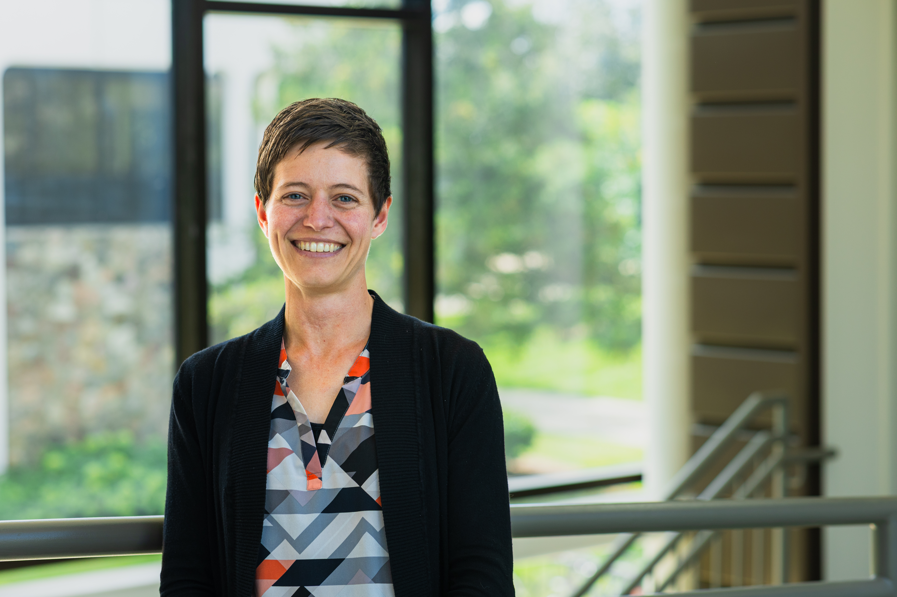

# Introduction {.unnumbered}

The waters of the Laurentian Great Lakes are a special treasure in a thirsty world. More than 30 million people in eight U.S. states and one Canadian province rely on this system for drinking water, food production, transportation, recreation, and cultural identity, making management of this precious resource an inherently collaborative endeavor.

{fig-alt="An aerial image of the Great Lakes, as seen from satellite view." fig-align="center"}

This book examines the dynamic interactions of people and the Great Lakes, including legacy pollution from industrialization and urbanization in the basin, as well as present-day management challenges associated with modern sources of pollution. It goes on to lead the reader through an applied analysis of stakeholder data collected from property owners in watersheds along the eastern shore of Lake Michigan, providing an introduction to data management, descriptive statistical analysis, and accessible reporting.

This text is an Open Educational Resource (OER), which means that it is freely available to you. It is a collection of curated content and contains links to additional resources that provide more in-depth coverage of topics introduced here.

As we move from historical account to data analysis, you'll see models of `inline coding` and outputs from the R statistical package (version 4.5.0). These examples are included to provide context for lab activities that will be completed in class.

Use the links at the left or the arrows at the bottom of the page to navigate through chapters in this text.

## Author

```{=html}

```

Amanda Buday is an Associate Professor of Sociology and Water Resources at the Grand Valley State University Annis Water Resources Institute. 
Her work focuses on people’s relationships with and management of natural resources, helping ecological scientists and conservation organizations understand the communities connected to their projects. 
She also coordinates the Water Science in Agriscience program, a community science initiative that engages classrooms in the National FFA Organization (formerly Future Farmers of America) to monitor local streams and build connections between land stewardship and water quality. 
She may be contacted at <budaya@gvsu.edu>.

::: clear
:::

## Acknowledgements

OpenAI's ChatGPT (5.2) was used for support with drafting and R coding.

## Licensing

[](https://creativecommons.org/licenses/by-nc-sa/4.0/)

This book is licensed under a **Creative Commons Attribution–NonCommercial–ShareAlike 4.0 International License**.
